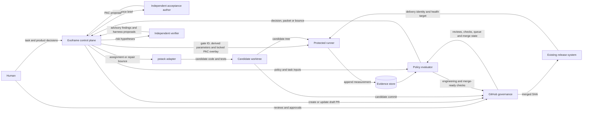

# Exoframe: Autonomous Delivery Around pstack

- **Status:** MVP specification
- **Product:** Exoframe
- **Implementation engine:** third-party pstack/poteto-mode, used without modification
- **Default hosting:** GitHub and GitHub Actions
- **Post-MVP extensions:** [Provider and Plugin Architecture](./exoframe-post-mvp.md)

---

# Part I — What Exoframe is

## 1. Purpose

Exoframe takes a software task, lets pstack implement it, independently checks the result, and moves it through pull request, review, merge, and delivery.

Its purpose is to give coding agents more autonomy without asking a human to repeatedly inspect routine work or trust an agent's claim that its own work is correct.

Exoframe provides:

- automatic repository discovery, risk assessment, and acceptance preparation;
- a clean assignment and repair loop around pstack;
- independent, reproducible verification;
- automatic pull-request creation and pipeline monitoring;
- human involvement only for real decisions and required reviews;
- safe progression toward automatic merge for proven low-risk work;
- a durable record of what ran, against which commit, and why it passed.

The central rule is simple:

> Pstack may build and check its work, but it cannot award itself the final PASS.

## 2. Product boundary

Exoframe is a new project. Retemper is an inspiration and an owner-authorized possible source of code, but Exoframe does not need to preserve Retemper's name, phase structure, or compatibility. Because Retemper and Exoframe have the same owner, reuse of Retemper-owned code does not require attribution or credit. Every reuse must still record immutable engineering provenance: the source repository and exact commit or revision, source path, Exoframe destination path, and modification notes. This authorization does not cover third-party or vendored material found inside Retemper; that material remains subject to its own license.

Pstack/poteto-mode is a third-party implementation engine. Exoframe must not modify, fork, or copy its internals. Exoframe integrates with it through an owned adapter and its supported public capabilities.

```text
                    owns policy and evidence
                 ┌──────────────────────────┐
User task ───────▶│        Exoframe         │
                 └────────────┬─────────────┘
                              │ bounded assignment / repair bounce
                              ▼
                 ┌──────────────────────────┐
                 │ pstack / poteto-mode     │  unchanged third party
                 │ plans and implements     │
                 └────────────┬─────────────┘
                              │ candidate code, tests, observations
                              ▼
                 ┌──────────────────────────┐
                 │ Exoframe verification   │
                 └────────────┬─────────────┘
                              │ eligible candidate
                              ▼
                 GitHub review / queue / merge / delivery
```

## 3. One complete run

### Step 1 — The user gives Exoframe a task

For MVP, the input is task text and a repository checkout:

```text
exoframe run "Add CSV export to the orders page"
```

External references such as `ABC-123` are post-MVP provider work described in `exoframe-post-mvp.md`.

### Step 2 — Exoframe prepares the work automatically

Exoframe:

1. inspects the repository and its existing commands;
2. turns the task into a short intent with explicit non-goals;
3. finds the affected product surfaces;
4. classifies the risk;
5. defines observable acceptance outcomes;
6. derives the checks required for this task.

No human is needed when the task is sufficiently clear. Exoframe asks the user only when it cannot safely resolve a product, design, security, authorization, or exception decision.

Steps 2 and 3 start automatically as part of the same run. Neither is a user approval checkpoint. The acceptance author in Step 3 is an independent machine role scheduled by Exoframe, not a human reviewer.

Exoframe does not have or require a Retemper-style interactive Planning phase. The canonical boundary is:

- **Exoframe prepares the run:** intent, non-goals, surfaces, risk, acceptance outcomes, gates, and writable scope;
- **pstack plans the implementation:** repository exploration, technical choices, work decomposition, and execution.

A user-supplied plan may be included as task context, but it is optional and cannot bypass Exoframe's independently derived controls.

### Step 3 — Exoframe proves the behavior is initially missing

For a user-visible change or bug fix, an independent acceptance author creates a small executable acceptance contract. The protected runner executes it against the base version and confirms that it fails for the intended reason.

This prevents a meaningless test that was already green before the change.

### Step 4 — Exoframe sends a bounded assignment to pstack

The assignment contains:

- the task intent and acceptance-contract IDs;
- affected surfaces and risk hypotheses;
- paths pstack may change;
- required verification IDs;
- a focused failure report when this is a retry.

It does not tell pstack how to implement the solution.

### Step 5 — Pstack plans and implements

Through its existing utilities, pstack may use:

- repository exploration;
- implementation planning and work decomposition;
- parallel implementation workers;
- outside-in TDD;
- coding and refactoring;
- unit, integration, and acceptance-test execution;
- application startup and control;
- browser, API, CLI, simulator, debugger, log, network, trace, and profiling tools;
- advisory self-verification.

Exoframe discovers supported pstack capabilities through its adapter. It does not depend on undocumented pstack internals.

### Step 6 — The candidate returns to Exoframe

Pstack returns candidate code, tests, changed paths, and diagnostic observations. These are useful but not authoritative.

Exoframe automatically creates or updates a draft pull request for the first coherent candidate. The pull request gives GitHub and protected CI a stable commit to evaluate.

### Step 7 — Exoframe verifies independently

The protected runner executes only the checks derived for the task. It records results against the exact candidate commit. The evaluator then decides whether the evidence satisfies every required gate.

If a gate fails or is flaky, Exoframe sends pstack a small repair bounce containing the exact failure, relevant evidence, and minimal rerun scope. The run returns to Step 5.

If all engineering gates pass, the task becomes `ENGINEERING_READY`.

### Step 8 — GitHub applies review and merge rules

Exoframe publishes checks to GitHub. GitHub remains responsible for branch protection, required reviewers, CODEOWNERS, merge queues, and the actual merge.

- If a review is required, the run waits without keeping an agent active.
- If changes are requested, Exoframe sends the actionable findings back to pstack.
- If no review is required, merge behavior still follows Exoframe's risk and autonomy policy.
- An agent never directly merges. When automatic merge is permitted, GitHub's native auto-merge or merge queue performs it.

### Step 9 — Exoframe verifies delivery

The existing project release system publishes or deploys. Exoframe observes the released commit and declared health checks; it does not become a universal deployment tool.

An unhealthy delivery invokes the project's rollback policy and opens a linked repair run. A healthy delivery completes the run.

### The whole loop

```text
Task
  │
  ▼
Automatic intake, risk, acceptance, gates
  │
  ▼
Protected acceptance RED when a PAC is required
  │
  ▼
pstack plans and implements
  │
  ▼
Draft PR + protected verification
  │
  ├── FAIL / FLAKY ──▶ focused bounce ──▶ pstack repairs
  │
  ▼ PASS
Required review or human merge authorization, if any
  │
  ▼
GitHub prepares the exact merge candidate; G7 checks it
  │
  ▼
Merge and existing release process
  │
  ├── unhealthy ──▶ rollback + linked repair run
  │
  ▼ healthy
DONE
```

## 4. What a gate means

A gate is a requirement that must be satisfied before the run can move forward. A gate is not always a test.

```text
Check       performs an observation
Measurement records what happened and where
Gate        decides whether that evidence satisfies a requirement
```

Example:

```text
Gate:        CSV export works for an empty order list
Check:       Run the protected browser acceptance scenario
Measurement: Assertions, commit SHA, runner identity, and artifacts
Result:      PASS or FAIL
```

| Gate | Plain meaning | Usually a written test? |
|---|---|---|
| G0 Integrity | The task did not bypass Exoframe's policy or trust boundary | No |
| G1 Engineering | Required unit tests, lint, typecheck, build, and security checks pass | Usually |
| G2 Acceptance | The locked user behavior was red before and is green now | Yes |
| G3 Adversarial | Risk-specific edge cases and attack hypotheses have been exercised | Usually |
| G4 Runtime | The real supported UI, API, CLI, or simulator behavior works | Sometimes |
| G5 Release form | The actual package, image, migration, or preview works | Often |
| G6 Governance | Required reviews, approvals, and repository rules are satisfied | No |
| G7 Merge candidate | The exact candidate GitHub is about to land still passes | Usually |
| G8 Delivery | The deployed artifact is the expected one and is healthy | No |
| G9 Learning | An escaped defect now has a durable regression and replay proof | Usually |

Not every task uses every gate. Exoframe derives only the gates required by the affected surfaces and risk.

## 5. When humans are involved

| Situation | Human needed? |
|---|---|
| Repository discovery, risk derivation, routine tests, or pipeline polling | No |
| Clear low-risk task | No during implementation and verification |
| Product behavior cannot be inferred safely | Yes, one batched decision request |
| Repository or CODEOWNERS requires review | Yes |
| No reviewer is required, but merge mode is `human_merge` | Yes, to authorize merge |
| Exoframe classifies the task as R2 or R3 | Yes for targeted review |
| A required check cannot currently be measured | Yes, to accept a temporary gap or stop |
| A check appears to be a false positive | Yes, to approve a narrow temporary override |
| Trust policy, runner, or evaluator is changed | Yes |

Waiting for a reviewer is not `DONE`. Exoframe persists the run and resumes from a GitHub event or a later `exoframe resume` call.

## 6. Pull requests and automatic merge

Exoframe creates a draft PR automatically after the first coherent pstack candidate. Creating the PR is not the end of the run.

There are two merge modes:

| Mode | Behavior |
|---|---|
| `human_merge` | Default. Exoframe waits for an authenticated human to authorize the protected GitHub merge path after all checks pass. |
| `github_auto_merge` | GitHub merges an eligible R0/R1 candidate after all protected rules pass. |

Rules:

- every repository begins in `human_merge`;
- R2 and R3 always remain human-reviewed in MVP;
- a task with an exception always remains human-governed;
- R0/R1 may earn automatic merge from measured history;
- Exoframe may enable GitHub auto-merge, but an agent cannot call a privileged merge operation directly;
- G7 always checks the exact merge candidate, whether or not the repository uses GitHub merge queues.

## 7. MVP scope

### Included

- direct task text and a repository checkout;
- automatic intake, risk, acceptance, and gate derivation;
- unchanged pstack/poteto-mode integration;
- protected execution, evidence, and evaluation;
- focused repair bounces;
- GitHub pull requests, reviews, checks, queue state, and auto-merge;
- GitHub Actions as the default pipeline;
- delivery observation and escaped-defect learning;
- progressive R0/R1 autonomy.

### Not included

- a second implementation orchestrator beside pstack;
- modifications to pstack/poteto-mode;
- arbitrary model-written commands as trusted verification;
- an agent-controlled merge or universal deployment engine;
- a web dashboard;
- Jira, Linear, GitLab, Jenkins, Slack, or a general plugin marketplace;
- automatic product decisions when requirements are genuinely ambiguous.

Provider and plugin work is intentionally deferred to `exoframe-post-mvp.md`.

## 8. Success criteria

Exoframe is successful when it reduces human effort without reducing quality. Track:

- active human minutes per task;
- time from task to engineering-ready and merge;
- percentage of tasks completed without an implementation interruption;
- bounce cycles and repeated failure fingerprints;
- flaky verification rate;
- escaped defects and rollback rate by risk tier;
- automatic-merge rate for eligible R0/R1 work;
- cases where Exoframe classified risk too low;
- token and runner cost per completed task.

Autonomy must automatically decrease when quality worsens.

---

# Part II — Implementation specification

## 9. Normative language and fixed decisions

`MUST`, `MUST NOT`, `SHOULD`, and `MAY` have their ordinary RFC-style meanings.

The following decisions are fixed for MVP:

```yaml
product_name: exoframe
implementation_engine: pstack
modify_implementation_engine: false
default_repository_provider: github
default_pipeline_provider: github-actions
default_merge_mode: human_merge
authoritative_runner: protected-and-pinned
authoritative_local_agent_output: false
unknown_production_risk_floor: R2
trust_boundary_change_floor: R3
agent_direct_merge: false
plugin_system: post-mvp
```

## 10. Architecture and authority



### 10.1 Responsibilities

| Component | Owns | Must not do |
|---|---|---|
| Exoframe control plane | intake, risk, surfaces, acceptance lock, gates, scheduling, state, bounces, packets | implement product code or invent measurements |
| pstack adapter | translate assignments and bounces to supported pstack capabilities | modify pstack or claim authoritative PASS |
| Acceptance author | define observable behavior before implementation | implement the behavior it independently judges when separation is required |
| Independent verifier | attack R2/R3 hypotheses and propose durable harnesses | change expected semantics or final status |
| Protected runner | resolve templates, sandbox commands, redact, hash, append measurements | interpret product intent or accept raw trusted commands |
| Evaluator | derive required gates, validate evidence, calculate state and reuse | execute product commands or trust PR-controlled policy |
| GitHub adapter | PRs, checks, reviews, protections, queue, merge state | weaken GitHub rules or let agents merge directly |
| Release system | publish, deploy, observe, roll back | treat an agent claim as delivery health |

### 10.2 Authoritative inputs

Only these may affect final status:

- policy and templates accepted by the task's actual base commit;
- measurements written by the protected runner;
- authenticated GitHub review, protection, queue, and merge state;
- authenticated human decisions and exceptions;
- evaluator decisions produced by an accepted evaluator version;
- authenticated delivery observations mapped to G8.

Agent prose, local logs, screenshots without runner provenance, and YAML containing `PASS` are advisory only.

## 11. Core concepts

| Term | Meaning |
|---|---|
| Task | The requested user outcome plus source identity |
| Intent | Short statement of goals, non-goals, constraints, and unresolved decisions |
| Surface | A product boundary users or systems consume: UI, API, CLI, package, job, migration, or deployment |
| PAC | Protected Acceptance Contract: locked behavior, executable probe, and expected observations |
| Gate | A requirement that must be satisfied before progression |
| Template | Protected command definition used to execute a gate |
| Measurement | Immutable runner record of one attempt |
| Evidence key | Identity of exactly what was checked, with which template and environment |
| Bounce | Small repair assignment created from a failed or flaky gate |
| Decision packet | Minimal information needed for one human decision or review |
| Escaped defect | A defect found after merge or delivery that should have been caught earlier |

## 12. Run state

```mermaid
stateDiagram-v2
  [*] --> INTAKE
  INTAKE --> WAITING_FOR_INTAKE_DECISION: blocking product decision
  WAITING_FOR_INTAKE_DECISION --> INTAKE: decision recorded
  INTAKE --> INTAKE: wrong intended red, repair PAC
  INTAKE --> INTAKE_BLOCKED: runner or environment unavailable
  INTAKE_BLOCKED --> INTAKE: prerequisite restored
  INTAKE --> IMPLEMENTING: intent and gates ready, PAC when required
  IMPLEMENTING --> WAITING_FOR_IMPLEMENTATION_DECISION: new blocking product decision
  WAITING_FOR_IMPLEMENTATION_DECISION --> IMPLEMENTING: decision recorded
  IMPLEMENTING --> VERIFYING: coherent candidate
  VERIFYING --> IMPLEMENTING: FAIL or FLAKY bounce
  VERIFYING --> VERIFYING_BLOCKED: runner or environment unavailable
  VERIFYING_BLOCKED --> VERIFYING: prerequisite restored
  VERIFYING --> WAITING_FOR_EXCEPTION: gap or override proposed
  WAITING_FOR_EXCEPTION --> VERIFYING: rejected, expired or more evidence required
  WAITING_FOR_EXCEPTION --> ENGINEERING_READY_WITH_EXCEPTION: approved with compensating evidence
  VERIFYING --> ENGINEERING_READY: all engineering gates pass
  ENGINEERING_READY --> WAITING_FOR_REVIEW: review required
  ENGINEERING_READY_WITH_EXCEPTION --> WAITING_FOR_REVIEW: mandatory packet and human merge
  WAITING_FOR_REVIEW --> IMPLEMENTING: changes requested
  WAITING_FOR_REVIEW --> MERGE_READY: approvals and G6 satisfied
  ENGINEERING_READY --> MERGE_READY: no review required and G6 satisfied
  MERGE_READY --> WAITING_FOR_MERGE: human_merge
  WAITING_FOR_MERGE --> MERGING: human authorizes protected merge
  MERGE_READY --> MERGING: github_auto_merge permitted
  MERGING --> IMPLEMENTING: G7 failure
  MERGING --> MERGED: G7 passes and GitHub lands candidate
  MERGED --> RELEASE_PENDING: release action required
  MERGED --> DELIVERY_VERIFYING: automatic delivery or no delivery target
  RELEASE_PENDING --> DELIVERY_VERIFYING: release observed
  DELIVERY_VERIFYING --> DONE: G8 healthy or not applicable
  DELIVERY_VERIFYING --> WAITING_FOR_REPAIR: G8 unhealthy, rollback and linked repair run
  WAITING_FOR_REPAIR --> DELIVERY_VERIFYING: linked repair delivered
```



An escaped defect discovered after `DONE` creates a new linked learning/repair run. That run must add a durable regression and prove through G9 that the new process fails on the preserved defective snapshot.

### 12.1 Separate result types

Runner attempts, gates, engineering readiness, run state, and GitHub governance MUST remain separate types:

```text
RunnerAttempt = PRODUCT_PASS | PRODUCT_FAIL | PRODUCT_TIMEOUT | INFRA_ERROR
GateResult    = PASS | FAIL | FLAKY | BLOCKED | STALE | NOT_APPLICABLE
Engineering  = NOT_EVALUATED | WAITING_GATES | FAIL | BLOCKED |
               NEEDS_HUMAN | ENGINEERING_READY |
               ENGINEERING_READY_WITH_EXCEPTION
MergeMode    = human_merge | github_auto_merge
```

The evaluator applies this precedence after validating live exceptions:

1. an unhandled required `FAIL` or `FLAKY` produces engineering `FAIL`;
2. a product decision or exception approval that only a human can provide produces `NEEDS_HUMAN`;
3. an unavailable non-human prerequisite produces `BLOCKED`;
4. missing, stale, queued, or running evidence produces `WAITING_GATES`;
5. all requirements covered with a live accepted gap or override produces `ENGINEERING_READY_WITH_EXCEPTION`;
6. every required engineering gate has authoritative PASS produces `ENGINEERING_READY`.

An exception covers progression; it never changes the underlying gate result to PASS.

## 13. Automatic intake

MVP inputs:

```yaml
task_input:
  text: Add CSV export to the orders page
  repository: current-checkout
  base_ref: actual-default-branch-base
```

Exoframe MUST automatically:

1. read repository instructions and existing test/build commands;
2. compute the actual base and diff context;
3. identify task goals, non-goals, and constraints;
4. match likely affected surfaces;
5. classify risk conservatively;
6. identify whether a PAC is required;
7. collect blocking questions into one packet.

It MUST NOT ask a human for discoverable repository facts. If a product decision blocks all meaningful work, state becomes `WAITING_FOR_INTAKE_DECISION`. Otherwise safe independent work continues.

When G2 is required, Exoframe dispatches a dedicated acceptance-author agent before pstack. It has a distinct authenticated identity and may write only PAC/probe artifacts. It cannot become the pstack implementer for that task. R0 work and behavior-preserving work without a new acceptance claim do not dispatch this agent.

## 14. Surfaces and risk

### 14.1 Risk tiers

| Tier | Meaning | Examples | Default review |
|---|---|---|---|
| R0 | Non-behavioral or mechanically safe | documentation, formatting-only generated output | none after policy allows |
| R1 | Ordinary local behavior with cheap rollback | local validation, small internal behavior | none after policy allows |
| R2 | Public contract, state, costly rollback, or meaningful uncertainty | API, persistence, background job, package, unknown production path | targeted human review |
| R3 | Security, money, data loss, irreversible migration, or control plane | authorization, destructive storage, billing, runner/policy changes | critical human review and rollback review |

Risk MUST fail upward. Signals may raise a tier but an implementation agent cannot lower one. Unknown production paths receive provisional R2 coverage. Control-plane and trust-boundary changes are R3. Exoframe keeps R0–R3. It MUST NOT add R4 or a 0–100 score.

### 14.1.1 Operator interface

The host AI engine runs the Exoframe workflow through the project skill in `.cursor/skills/exoframe/`. Exoframe MUST NOT call a model API or require a model API key. The host session supplies semantic understanding (scope facts, implementation via pstack/poteto-mode). The library supplies deterministic policy (`matchSurfaces`, `classifyRisk`, `applyScopeFacts`, `reevaluateRisk`, `bootstrapSurfaces`).

The CLI in `src/cli.ts` is a local lever for durable intake state and argv-locked `gate run`. It MUST NOT become the operator product and MUST NOT call models. Protected templates still reject raw command text.

### 14.1.2 Scope facts and two evaluations

After intent is clear and before pstack implements, the host engine extracts scope facts. Facts name predicted paths, change types, sensitive-domain flags, blast radius, and uncertainty (`KNOWN` | `PARTIALLY_KNOWN` | `UNKNOWN`). Facts answer what is likely to change. They do not award autonomy.

Pre-work risk is `applyScopeFacts(classifyRisk(predicted paths), facts)`. Post-diff risk repeats that function on the actual candidate paths. `reevaluateRisk` takes both decisions. Overall is the maximum. Extra actual paths escalate. Predicted paths that were not changed MUST NOT lower overall. Merge and review follow post-diff overall.

### 14.1.3 Surface bootstrap

A repository without `.exoframe/surfaces.json` MUST run `bootstrapSurfaces` and open a human-reviewed proposal under `.exoframe/proposals/`. Bootstrap writes `.exoframe/proposals/surfaces.yaml` as the human-readable full catalog. It writes `.exoframe/proposals/catalog.json` as the full catalog to copy into `.exoframe/surfaces.json`. It writes `.exoframe/proposals/surfaces.json` as the `matchSurfaces` proposal `{ schema_version, surfaces }`. The runtime accepted catalog is `.exoframe/surfaces.json`. The proposal is a surface catalog, not a parallel `.pstack-risk.yml`. Product implementation MUST NOT start until a human copies the accepted catalog into `.exoframe/surfaces.json`. A later agent MUST NOT lower an accepted floor.

### 14.2 Path categories

Every changed path is classified by base policy:

| Category | Meaning | Default treatment |
|---|---|---|
| `production` | code or configuration that can affect shipped behavior | must match a surface; unmatched paths become provisional R2 |
| `verification` | tests, fixtures, and harnesses that do not ship | inherit the affected surface; oracle changes follow PAC rules |
| `control_plane` | Exoframe policy, runner, evaluator, templates, or trusted workflows | R3 |
| `untracked_ok` | declared non-production material such as ordinary documentation | R0 unless another signal raises it |

If Exoframe cannot determine whether a path can affect production, it treats that path as `production`. Unmatched documentation is not automatically R2 when base policy safely classifies it as `untracked_ok`.

### 14.3 Surface catalog

`.exoframe/surfaces.yaml` maps product boundaries to paths, risk floors, consumption exercises, hypotheses, and gate templates.

```yaml
surfaces:
  - id: orders-export
    paths: [src/orders/**, tests/orders/**]
    consumption: browser
    risk_floor: R2
    exercises: [g4.orders-export-browser]
    hypotheses: [authorization-is-enforced, empty-export-is-valid]
    publishes_artifact: false
```

Every changed production path MUST match a declared or provisional surface. A proposal may automatically add coverage or raise risk. Removing coverage, risk, hypotheses, or gates is a protected policy weakening requiring human approval.

### 14.4 Gate derivation

Gate selection is a pure function of base policy, actual diff, surfaces, risk, PACs, and delivery metadata.

Defaults:

| Condition | Required gates |
|---|---|
| Every task | G0 and repository-required G1 |
| User-visible feature or bug fix | G2 |
| R2/R3 | mapped G3 hypotheses and independent verifier |
| Surface declares runtime exercise | G4 |
| Surface publishes artifact or preview | G5 |
| Before merge | G6 and G7 |
| Delivery target exists | G8 |
| Escaped defect exists | G9 |

## 15. Protected Acceptance Contract

A PAC locks observable meaning before pstack implements production behavior.

```yaml
contract:
  schema_version: 1
  id: orders-export-empty
  task_id: TASK-184
  surface_id: orders-export
  claim: Empty order history exports a valid CSV containing only headers.
  outcomes:
    - id: download-succeeds
      observation: response_status
      matcher: equals
      expected: 200
    - id: csv-has-only-header
      observation: csv_rows
      matcher: equals
      expected: 1
  intended_red: [download-succeeds]
  template_id: g2.orders-export
  artifact_paths: [tests/acceptance/orders-export.test.ts]
  semantic_digest: sha256:...
  oracle_digest: sha256:...
  locked_at_base_sha: abc123
```

Rules:

- initial PAC authoring is automatic when task semantics are clear;
- intended red MUST fail a named outcome while setup and the probe itself succeed;
- import errors, crashes, unrelated failures, and timeouts are not intended red;
- the same locked PAC must pass against the candidate;
- changing behavior semantics after lock requires authenticated human approval;
- changing probe code or fixtures creates a new oracle digest and requires a fresh base-red/head-green pair;
- for R2/R3, the implementer cannot independently re-lock its own changed oracle.

### 15.1 Intended-red overlay and outcomes

The acceptance author works before pstack and produces a PAC-only overlay. To test intended red, the protected runner:

1. checks out the actual base production tree;
2. overlays only locked PAC probe, fixture, selector, helper, and result-schema artifacts;
3. excludes every candidate production file;
4. runs the protected G2 template;
5. records setup success and the named outcome that failed.

The result routes deterministically:

| Result | Next action |
|---|---|
| Setup succeeds and the named missing behavior fails | intended red accepted; assign pstack |
| Probe, fixture, import, selector, or unrelated assertion is wrong | return to the acceptance author, update/re-lock the PAC, and retry |
| Expected behavior is ambiguous | emit a product-decision packet |
| Runner or environment fails | retry infrastructure twice, then enter `INTAKE_BLOCKED` |
| Behavior is already green on base | reject the claimed new behavior or require the intent/PAC to be corrected |

Candidate verification runs the same locked PAC against candidate production. Intended-red evidence records both the base production identity and PAC overlay digest, so candidate implementation cannot leak into the base run.

## 16. Protected runner

An authoritative run is selected by gate ID. The protected runner resolves that ID from base-policy templates.

```yaml
template:
  id: g2.orders-export
  gate_class: G2
  command:
    argv: [npm, test, --, tests/acceptance/orders-export.test.ts]
  timeout_seconds: 300
  network: none
  writable_roots: [tmp]
  result_schema: schemas/orders-export-result.json
  artifact_allowlist: [screenshots/**, traces/**]
```

Requirements:

- authoritative commands use argv arrays, never interpolated shell text;
- the authoritative CLI has no raw `--cmd` escape hatch;
- parameters are typed, evaluator-derived, and allowlisted;
- the candidate may request a run but cannot choose trusted command text;
- execution occurs in an isolated worktree/container with computed writable scope;
- output is parsed, redacted, hashed, and appended before it is considered evidence;
- runner or sandbox failure is `INFRA_ERROR`, not a product failure;
- infrastructure attempts retry twice by default and then become `BLOCKED`;
- screenshots and videos are evidence artifacts only when bound to runner, commit, and gate provenance.

## 17. Evidence and evaluation

### 17.1 Evidence identity

```text
evidence_key = (
  gate_id,
  template_digest,
  input_digest,
  environment_digest,
  oracle_digest_when_required
)
```

`input_digest` covers selected repository objects and named artifacts. `environment_digest` covers the runner image, toolchain, and capability profile. Ephemeral hostnames and timestamps are excluded.

Each measurement records at least:

```yaml
measurement:
  id: run-20260831-001
  task_id: TASK-184
  gate_id: g2.orders-export
  measured_sha: def456
  base_sha: abc123
  policy_digest: sha256:...
  runner_digest: sha256:...
  template_digest: sha256:...
  input_digest: sha256:...
  environment_digest: sha256:...
  oracle_digest: sha256:...
  deliberate_attempt: 1
  outcome: PRODUCT_PASS
  structured_observations: {}
  artifacts: []
  runner_identity: github-actions:exoframe-gates
  authoritative: true
```

Only the protected runner may write `authoritative: true`; callers cannot set it.

### 17.2 Store and reuse

The canonical evidence store is outside candidate write control and provides immutable bodies, authenticated writer identity, idempotent append, retention metadata, and read access for evaluator/reviewers.

Evidence may be reused only when every evidence-key field is identical for the target candidate and dependency selection is certain. Otherwise the gate becomes stale and is rerun. Reuse decisions are appended; original measurements are never rewritten.

For one evidence key, mixed product outcomes among the last three deliberate attempts produce `FLAKY`. Retrying until green cannot clear it. A relevant harness or input change must create a new evidence key.

### 17.3 Evaluation

The evaluator is a pure function over accepted base policy, task inputs, current candidate, authoritative events, GitHub state, and current time.

For each required gate it:

1. resolves the protected definition;
2. calculates the evidence key;
3. finds fresh authoritative evidence or proves reuse;
4. rejects advisory, stale, mismatched, or untrusted results;
5. produces the next state, required actions, bounce, or human packet.

An authoritative mechanical FAIL beats agent prose claiming success. Missing required evidence never counts as PASS.

## 18. Pstack adapter

The adapter is owned by Exoframe. Pstack/poteto-mode remains unchanged.

```yaml
assignment:
  schema_version: 1
  task_id: TASK-184
  intent_ref: intent://TASK-184
  contract_ids: [orders-export-empty]
  tier: R2
  surfaces: [orders-export]
  hypotheses: [authorization-is-enforced]
  required_gate_ids:
    - g0.integrity
    - g1.required
    - g2.orders-export
    - g3.orders-export-authorization
    - g4.orders-export-browser
  writable_scope:
    - src/orders/**
    - tests/orders/**
    - .exoframe/proposals/**
  capabilities:
    network: repository-policy
    secrets: none
```

Adapter responsibilities:

- detect the installed pstack version and supported capability IDs;
- translate an assignment into supported pstack invocation;
- allow pstack to plan and use its utilities normally;
- collect the returned candidate and advisory observations;
- translate Exoframe bounces into focused repair work;
- fail clearly when a required pstack capability is missing.

The adapter MUST NOT copy pstack playbooks, reach into undocumented internals, patch third-party installation files, or treat pstack output as authoritative evidence.

## 19. Failure, bounce, and human decisions

### 19.1 Repair bounce

```yaml
bounce:
  task_id: TASK-184
  candidate_sha: def456
  failed_gate: g4.orders-export-browser
  result: FAIL
  summary: Export button remains disabled for an empty order history.
  evidence_refs: [evidence://TASK-184/run-22]
  hypotheses: [empty-export-is-valid]
  allowed_paths: [src/orders/**, tests/orders/**]
  rerun_gate_ids: [g1.required, g2.orders-export, g4.orders-export-browser]
```

The bounce contains only information needed to repair the failure. After three bounces with the same normalized failure fingerprint, Exoframe emits one human packet rather than continuing indefinitely.

### 19.2 Human packet

A packet contains:

- one concrete question or review request;
- why automation cannot decide it;
- recommended answer and alternatives;
- affected behavior, risk, and exact candidate;
- concise evidence links;
- expiry and required approver identity.

Raw logs and routine green evidence remain linked, not forced into the review surface.

### 19.3 Exceptions

MVP has exactly two temporary exception types:

- **Accepted gap:** a required behavior cannot currently be measured; it needs compensating authoritative evidence, owner, reason, and expiry.
- **Override:** one specific authoritative failure is believed to be a false positive; it needs an independent approver, exact evidence key, owner, reason, and expiry.

Neither exception may cover G0, G2, G7, G8, FLAKY evidence, or a trust-boundary failure. Exceptions never relabel a failed gate as PASS and always disable automatic merge.

An approved exception with its required compensating evidence produces `ENGINEERING_READY_WITH_EXCEPTION`. It requires the mandatory human packet and `human_merge`. Rejection, expiry, or missing compensating evidence returns the run to verification; it does not leave the run permanently stuck.

## 20. GitHub, reviews, and merge

### 20.1 Pull request lifecycle

1. Exoframe creates a draft PR after the first coherent candidate.
2. Each pstack repair updates the same task PR unless repository policy requires another structure.
3. Exoframe publishes `exoframe/engineering` and `exoframe/merge-ready` checks.
4. GitHub reports required checks, reviews, CODEOWNERS, approval freshness, and queue state.
5. `ENGINEERING_READY`, or approved `ENGINEERING_READY_WITH_EXCEPTION`, plus satisfied G6 produces `MERGE_READY`.
6. Under `human_merge`, Exoframe waits in `WAITING_FOR_MERGE` until an authenticated human authorizes the protected merge path.
7. Under `github_auto_merge`, Exoframe asks GitHub to enable its native auto-merge mechanism.
8. GitHub or the protected candidate builder prepares the exact candidate identity and triggers G7.
9. G7 failure removes or blocks the candidate and creates a pstack repair bounce.
10. After G7 PASS, GitHub, not an agent, lands the candidate.

G7 does not require GitHub merge queues. Its candidate identity is:

- the queue-generated commit SHA when a merge queue exists; or
- without a queue, the immutable tuple `(base_sha, head_sha, merge_method, candidate_tree_digest)` produced by a protected candidate builder.

If base, head, merge method, or candidate tree changes, G7 becomes stale. After GitHub lands a non-queue merge, Exoframe confirms that the landed tree matches the G7 candidate tree. A mismatch fails closed and triggers the repository's recovery policy.

### 20.2 Progressive automatic merge

Repositories start in `human_merge`. The following are frozen MVP defaults; changing them is an R3 policy change:

| Tier | Minimum history | Required quality | Promoted mode |
|---|---|---|---|
| R0 | 20 eligible merges over at least 14 days | no severity-1/2 escape; p90 human time ≤2 min; flake ≤5% | `github_auto_merge` |
| R1 | 30 eligible merges over at least 21 days | no severity-1/2 escape; at most one replayed lower escape; p90 human time ≤5 min; flake ≤5% | `github_auto_merge` |
| R2/R3 | not eligible in MVP | human review required | `human_merge` |

Promotion uses authoritative repository history, not model judgment. Auto-merge is immediately disabled for an affected repository/tier when:

- a trust-boundary failure occurs;
- a severity-1/2 escaped defect occurs;
- two escaped defects lack replay proof within 30 days; or
- flake rate exceeds 15% within 30 days.

## 21. Delivery and learning

The existing project system owns publish, deployment, rollout, rollback, and production credentials.

G8 verifies:

- the delivered artifact or deployment contains the expected merged SHA;
- declared health and product invariants are healthy;
- the expected environment and route received the candidate.

If there is no delivery target, the evaluator marks G8 not applicable and may complete the run after merge. If delivery is unhealthy, the project rollback policy runs and Exoframe creates a linked repair run.

An escaped defect discovered after completion creates a new linked learning run. G9 passes only when:

1. a durable test, surface rule, policy rule, or harness fix exists;
2. the preserved defective snapshot fails under the new protection;
3. the repaired snapshot passes;
4. the missed gate and risk classification are recorded.

## 22. Root of trust and security

### 22.1 Base judges candidate

A candidate that changes Exoframe policy, templates, runner, evaluator, workflows, or provider trust MUST be judged by the accepted definitions from its actual base. Candidate-controlled code cannot approve itself.

Trust-boundary changes are R3, require critical human review, and become active only after protected merge.

### 22.2 Scope and capabilities

Exoframe computes writable scope from the task, affected surfaces, PAC artifacts, and gate sandboxes. Pstack may request expansion:

- expansion within an already affected surface may be automatic;
- a known new surface re-derives risk and gates;
- unknown production paths receive provisional R2 coverage;
- trust-boundary paths require human approval.

### 22.3 Secrets and artifacts

- secrets are injected only into templates that declare them;
- secrets never enter pstack assignments, argv text, task files, or model-visible logs;
- stdout, stderr, structured observations, and artifacts are redacted before storage;
- artifact types, paths, and sizes are allowlisted;
- symlink escapes and writes outside sandbox roots fail the gate;
- raw logs are access-controlled and are not mandatory human review content.

## 23. Repository files and configuration

```text
.exoframe/
  policy.yaml              risk, review, retry, promotion defaults
  surfaces.yaml            paths, product surfaces, exercises, hypotheses
  templates.yaml           protected gate command definitions
  contracts/               locked PACs
  proposals/               candidate-authored additions awaiting validation
  schemas/                 versioned task, PAC, measurement, and packet schemas
```

Minimal policy:

```yaml
schema_version: 1
risk:
  unknown_production_floor: R2
  trust_boundary_floor: R3
runner:
  infrastructure_retries: 2
  authoritative: protected-and-pinned
evidence:
  canonical_store: github-checks-and-artifacts
merge:
  default_mode: human_merge
  agent_direct_merge: false
bounce:
  repeated_fingerprint_limit: 3
```

Candidate changes under `.exoframe/` are proposals until accepted according to base policy. Lowering a tier, deleting coverage, weakening a template, or widening trusted capabilities requires protected human approval.

## 24. CLI and core interfaces

### 24.1 User CLI

```text
exoframe run <task text>
exoframe status [task-id]
exoframe explain [task-id]
exoframe resume <task-id>
exoframe evidence show <gate-id>
exoframe surfaces explain <path>
exoframe policy check
```

Protected execution:

```text
exoframe gate run --task <task-id> --gate <gate-id>
```

The protected command MUST reject raw command text. A clearly labeled local advisory command may exist but cannot write authoritative measurements.

Post-MVP provider commands are defined in `exoframe-post-mvp.md`.

### 24.2 Core interfaces

```text
normalizeTask(input, repositoryFacts) -> Intent | DecisionPacket
matchSurfaces(basePolicy, diff, catalog) -> SurfaceDecision
classifyRisk(basePolicy, intent, diff, surfaces) -> RiskDecision
parseScopeFacts(input) -> ScopeFacts
applyScopeFacts(risk, facts) -> RiskDecision
reevaluateRisk(planned, actual) -> RiskReevaluation
bootstrapSurfaces(checkoutRoot) -> SurfaceBootstrapResult
deriveGates(basePolicy, risk, surfaces, contracts, delivery) -> GatePlan
buildAssignment(intent, risk, surfaces, contracts, gates) -> PstackAssignment
computeEvidenceKey(gate, tree, artifacts, environment) -> EvidenceKey | Uncertain
evaluateTask(basePolicy, task, measurements, githubState, now) -> TaskDecision
buildBounce(taskDecision) -> Bounce | None
buildPacket(taskDecision) -> DecisionPacket | None
evaluatePromotion(policy, authoritativeHistory, now) -> PromotionDecision
```

Pure outputs MUST support canonical serialization and golden-vector tests.

## 25. Implementation plan

### Stage 0 — Baseline and reuse decisions

- create the Exoframe repository and product identity;
- record immutable engineering provenance for reused Retemper-owned code and
  preserve any licenses or notices required by third-party or vendored material;
- capture existing pstack invocation and capability behavior without modifying it;
- establish baseline human time, cycle time, flake, escape, and runner cost.

### Stage 1 — Simple run and state engine

- task input and repository discovery;
- intent, risk, surface, and state schemas;
- automatic intake and human-decision packet;
- persisted task state and `run/status/resume/explain` CLI.

### Stage 2 — Protected runner, evidence, and evaluator

- protected template lookup by gate ID;
- isolated runner and structured results;
- append-only evidence store;
- evidence-key calculation, reuse, and flake detection;
- pure evaluator and GitHub check output.

### Stage 3 — Acceptance, surfaces, and risk gates

- surface catalog and provisional R2 coverage;
- PAC authoring, lock, intended red, and candidate green;
- deterministic G0-G5 derivation;
- independent verifier path for R2/R3.

### Stage 4 — Pstack execution loop

- capability detection and health check;
- assignment translation without pstack changes;
- candidate collection;
- repair bounce and limited repeated-failure escalation;
- runtime-control and artifact integration through declared pstack capabilities.

### Stage 5 — GitHub and merge

- automatic draft PR creation/update;
- GitHub checks, reviews, CODEOWNERS, and approval binding;
- G6/G7 and merge queue integration;
- default human merge and progressive R0/R1 GitHub auto-merge;
- automatic demotion.

### Stage 6 — Delivery, learning, and hardening

- G8 release identity and health observation;
- rollback-triggered linked repair;
- escaped-defect record and G9 replay;
- secret redaction, artifact limits, retention, and kill switch;
- evaluation bank and staged production rollout.

Each stage must be usable and tested before the next stage becomes authoritative.

## 26. Required acceptance scenarios

### Intake and pstack boundary

1. A clear task proceeds from automatic intake to a pstack assignment without asking the user for repository facts.
2. A genuinely ambiguous product requirement produces one batched decision packet and no implementation begins.
3. Pstack may plan, implement, test, and return observations, but no pstack output can create authoritative PASS.
4. A missing required pstack capability fails with an actionable adapter error and does not patch pstack.

### Acceptance and gates

5. A user-visible task cannot proceed to implementation until its PAC produces the named intended red on base.
6. A crash, timeout, import error, or unrelated assertion does not count as intended red.
7. The intended-red base tree contains the locked PAC overlay but no candidate production implementation.
8. A wrong intended-red failure returns to the acceptance author for correction and re-lock rather than going to pstack.
9. The same locked PAC must produce green on the candidate.
10. A declared `untracked_ok` documentation change may remain R0, while an uncertain path fails upward to production treatment.
11. Unknown changed production code receives provisional R2 coverage.
12. Gate derivation is identical for identical base policy, diff, surfaces, contracts, and delivery inputs.
13. An R2/R3 hypothesis cannot disappear because an implementation agent edits a proposal.

### Trust and evidence

14. Raw model-authored commands and caller-provided argv cannot create authoritative evidence.
15. A PR that changes its runner or policy is judged by the accepted base version and cannot pass itself.
16. Evidence for the wrong commit, template, input, environment, or oracle cannot satisfy a gate.
17. Exact-key reuse succeeds without rerun; uncertain dependency selection becomes stale and reruns.
18. Mixed outcomes for one evidence key become FLAKY and rerun-until-green cannot clear them.
19. Two exhausted infrastructure retries produce BLOCKED rather than a product bounce.
20. Screenshots or video without runner and commit provenance remain advisory.
21. Independent-verifier prose or a harness proposal remains advisory until the protected runner measures an accepted harness.
22. The specified result-type precedence produces the same engineering status for the same authoritative inputs.

### Repair and human time

23. A failed gate creates a minimal bounce that returns to pstack and reruns only affected gates.
24. Three repeated equivalent failures create one human packet instead of an endless loop.
25. Waiting for a required review persists the run without keeping an agent active.
26. Review-requested changes return to pstack and replay affected protected gates.
27. Exceptions are narrow, expiring, independently approved, and disable automatic merge.
28. An approved exception with compensating evidence produces `ENGINEERING_READY_WITH_EXCEPTION`; rejection or expiry returns to verification.

### PR, merge, and delivery

29. The first coherent candidate creates or updates a draft GitHub PR automatically.
30. Zero GitHub-required reviewers still waits for human merge authorization while policy remains `human_merge`.
31. Eligible promoted R0/R1 work is merged by GitHub auto-merge, never by an agent operation.
32. R2/R3 and exception-bearing tasks cannot enter automatic merge.
33. G7 evaluates an exact queue-generated candidate when a merge queue exists and failure returns to pstack.
34. Without a queue, G7 binds base SHA, head SHA, merge method, and candidate tree; any change makes it stale and the landed tree must match.
35. The run is not DONE merely because a PR exists or CI is green.
36. A healthy expected deployment completes G8; an unhealthy one invokes rollback and a linked repair while the original run waits for that repair's delivery.
37. An escaped defect discovered after DONE creates a new linked run and cannot close without replay against the defective snapshot.

### Security and governance

38. Scope expansion inside an affected surface is automatic; unknown production becomes provisional R2; trust-boundary expansion needs approval.
39. Secrets in parameters, output, observations, or artifacts are redacted before storage.
40. Oversized, unallowlisted, or escaping artifacts are rejected without leaking their content.
41. A trust-boundary failure or severity-1/2 escape automatically disables R0/R1 auto-merge for the affected scope.

## 27. Definition of MVP complete

MVP is complete only when:

- the run from clear task text through pstack, draft PR, protected verification, GitHub governance, merge, and G8 is demonstrated end to end;
- pstack/poteto-mode remains unmodified and is accessed only through the Exoframe adapter;
- agents and candidate-controlled files cannot create authoritative PASS or directly merge;
- PAC intended-red/candidate-green, risk, surface, G0-G8, bounce, and evidence reuse work as specified;
- R2/R3 human-review requirements and R0/R1 promotion/demotion work;
- escaped defects create linked G9 replay runs;
- all required acceptance scenarios pass in protected CI;
- active human time, cycle time, flake, escape, and autonomy metrics are recorded;
- documentation explains the run before implementation detail and matches observable behavior.

## 28. Deferred to post-MVP

The following belong in `exoframe-post-mvp.md`, not MVP:

- Jira, Linear, GitHub Issues, and other task-source plugins;
- configurable task-reference routing such as `ABC-123`;
- repository providers beyond GitHub;
- pipeline providers beyond GitHub Actions;
- delivery, notification, and chat plugins;
- plugin discovery, registry, signing, installation, and permission UI;
- organization-wide plugin configuration inheritance.
