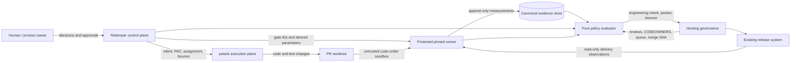
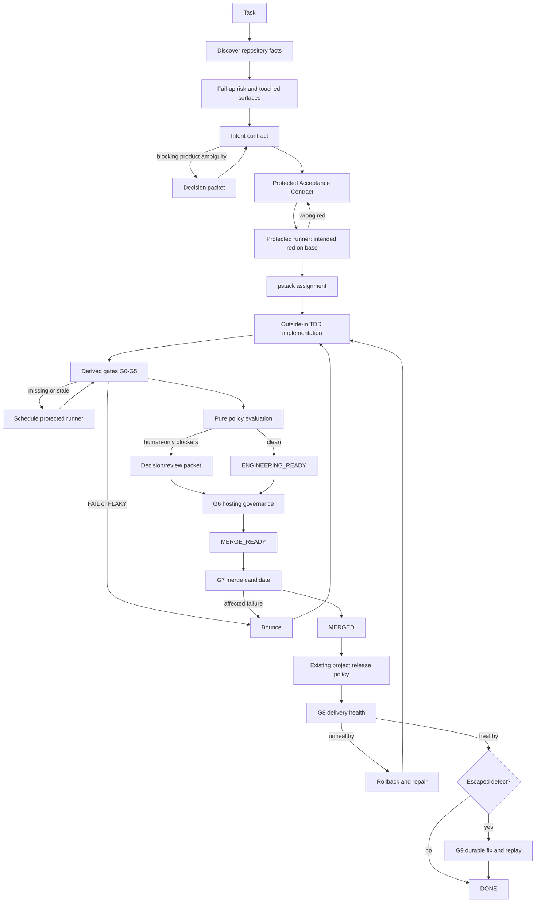
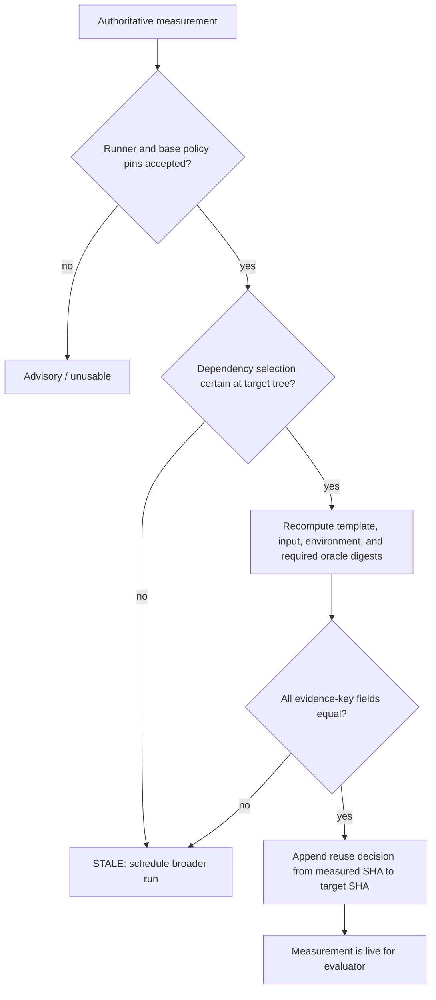
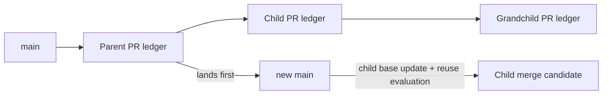
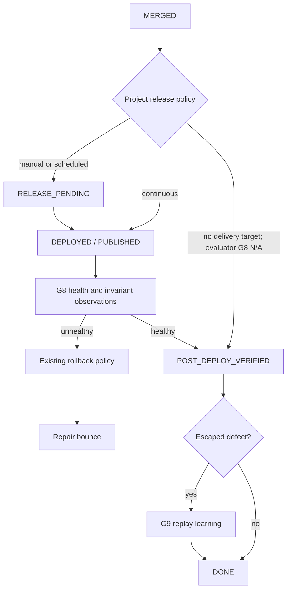
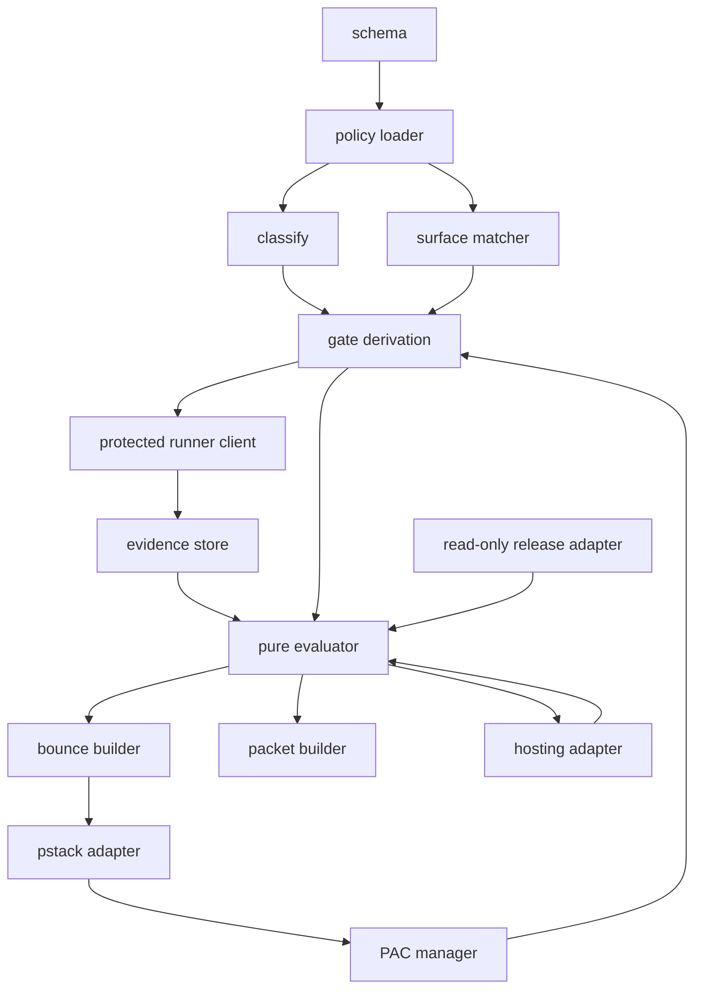

# Retemper x pstack: Risk-Adaptive Evidence SDLC

**Version:** 1.0 final specification

**Status:** accepted implementation contract

**Date:** 31 August 2026

**Scope:** Retemper control plane, pstack execution adapter, protected runner, policy evaluator, hosting adapters, and repository integration
**Source:** immutable v3 specification plus the accepted Codex/Grok iteration-2 close-out

## 1. Executive decision

This document specifies an SDLC for AI-authored changes that maximizes useful autonomy while keeping the authority to declare success outside the implementing model.

The system is built around five rules:

1. An agent may propose code, tests, risk, commands, and observations. It cannot author an authoritative `PASS`.
2. Verification cost scales with consequence and uncertainty, not line count or the number of available agents.
3. Every user-visible feature and bug fix starts with a protected, executable acceptance contract and follows outside-in TDD.
4. Evidence remains usable across commits only when a deterministic dependency digest proves that its inputs are unchanged.
5. Human attention is reserved for product decisions, explicit exceptions, R2 targeted review, R3 critical review, trust-policy changes, and project governance.

The intended steady-state human cost is:

| Risk | Human interactions after promotion |
|---|---:|
| R0 | 0 when the decision packet is empty |
| R1 | 0 when the decision packet is empty |
| R2 | 1 targeted review and merge interaction |
| R3 | 1 critical review and merge interaction |

A task may require an earlier additional interaction when a genuine product decision must be made before a reviewable diff can exist. The system batches such decisions; it does not pretend that they can safely be deferred until merge.

### 1.1 Normative language

`MUST`, `MUST NOT`, `SHOULD`, `SHOULD NOT`, and `MAY` are normative. When examples differ from a normative rule, the normative rule wins.

The shared engineering standard at `/Users/krzysztofkabala/.agents/AGENTS.md` applies. A repository MAY add stricter rules but MUST NOT weaken that standard.

### 1.2 Frozen defaults

```yaml
merge_gate: required_hosting_check
execution_plane: pstack
risk_model: fail_up_R0_to_R3
risk_downgrade: human_or_versioned_policy
outside_in_tdd: required
authoritative_local_evidence: false
authoritative_runner: protected_and_pinned
caller_supplied_trusted_commands: forbidden
unknown_production_path: provisional_R2
r3_human_critical_diff: required_at_G6
default_merge_mode: human_merge
autonomous_merge: hosting_auto_merge_after_promotion
agent_merge: forbidden_in_mvp
release_trigger: existing_project_policy
mechanical_fail_override: audited_exception_only
accepted_gap: audited_unmeasurable_only
attestation_mvp: protected_runner_record
secret_redaction: required
canonical_evidence_store: append_only_outside_pr_control
spawn_fallback_R2_R3: needs_human
escaped_defect_replay: required
```

Changing a frozen default is a control-plane change governed by section 22.

## 2. Goals, non-goals, and success

### 2.1 Goals

The system MUST:

- maximize merged useful changes multiplied by correctness, maintainability, and reliability;
- minimize active human minutes, serial review latency, escaped defects, flaky verification, token cost, and ceremony;
- make every engineering decision reproducible from protected policy and authoritative events;
- fail closed when scope, surface, evidence, or policy interpretation is uncertain;
- preserve speed through affected checks, evidence reuse, parallel safe work, reusable harnesses, and concise bounce packages;
- leave project hosting, merge queues, release systems, and production ownership authoritative;
- turn escaped defects into durable tests, policy, or surface knowledge with replay proof.

### 2.2 Non-goals

The MVP MUST NOT become:

- a second implementation orchestrator beside pstack;
- a serial Cleaner -> Review -> Final QA agent pipeline;
- a universal deployment system or merge button;
- a mandatory DDD, hexagonal, formal-methods, or browser-E2E framework;
- a cryptographic attestation platform;
- a helper-level build or test dependency compiler;
- a reason to spawn more reviewers when one focused verifier and executable evidence suffice.

### 2.3 Success metrics

Success is evaluated per repository and risk tier. Metrics MUST be considered together:

- active human packet minutes and calendar waiting time;
- percentage of eligible R0/R1 tasks completed without human review;
- lead time and p90 verification time;
- escaped defects by severity and the gate that missed them;
- rollback and revert rate;
- bounce cycles per accepted task;
- flaky evidence rate;
- authoritative evidence reused versus rerun;
- token and runner cost per accepted task;
- replay proof completed for escaped defects;
- risk under-classification discovered later;
- promotion, demotion, exception, and trust-boundary events.

The process is successful only if throughput and human-time improve without worsening severity-1/2 escapes, rollback, or trust-boundary failures.

## 3. System architecture



### 3.1 Components

| Component | Responsibility | Trust status |
|---|---|---|
| Retemper control plane | classify, derive surfaces and gates, lock contracts, schedule work, build ledgers, bounce, packets, and status | policy-controlled; cannot create measurements |
| pstack adapter | perform the smallest coherent implementation using repository playbooks and outside-in TDD | untrusted producer |
| Oracle owner | define observable acceptance before production implementation; re-lock protected contracts | independent where required; cannot set final status |
| Independent verifier | attack explicit R2/R3 hypotheses on declared surfaces | untrusted observer; proposes harnesses and observations |
| Protected runner | resolve templates, enforce capabilities, execute probes, redact, hash, and append measurements | authoritative measurement writer |
| Policy evaluator | pure function over base policy, current tree, authoritative events, and hosting state | sole engineering-status calculator |
| Hosting adapter | expose reviews, CODEOWNERS, required checks, queue ordering, and merge state | governance authority |
| Existing release system | publish, deploy, roll back, and expose health | delivery authority |

### 3.2 Trust boundary

The following are authoritative:

- base-policy definitions loaded from the task's actual base;
- a protected runner whose immutable digest is trusted by base policy;
- append-only runner measurements;
- authenticated hosting status and approvals;
- authenticated human exception and semantic-approval records;
- evaluator results produced for a named policy and evaluator digest.

The following are advisory only:

- model prose, self-review, or YAML containing `PASS`;
- local command output from a normal agent shell;
- caller-supplied command lines;
- screenshots or copied logs without runner and revision provenance;
- output from runner or workflow code modified by the PR under evaluation;
- evidence with an unknown dependency selection, missing digest, wrong policy, wrong runner, or expired exception.

### 3.3 Threat model

The MVP protects against:

- accidental or motivated self-grading by an implementation agent;
- weakening tests or helpers while leaving prose outcomes unchanged;
- relabeling a cheap or empty command as a required gate;
- reusing stale evidence after a relevant change;
- treating unknown production code as low risk;
- changing the evaluator, runner, workflow, policy, or exceptions to approve that same change;
- rerunning flaky work until it happens to be green;
- leaking secrets through commands, logs, artifacts, or PR runners;
- writing outside the authorized implementation or gate sandbox;
- bypassing CODEOWNERS, required reviews, merge queues, or release policy.

The MVP does not protect against a compromised hosting provider, compromised protected-runner administrator, malicious authorized human approver, or arbitrary supply-chain compromise outside the declared runner image and dependencies.

## 4. Ubiquitous language

| Term | Meaning |
|---|---|
| Task | One requested, observable outcome with a stable identifier |
| Base | The actual parent revision against which a task or stack node is reviewed |
| Head | The current proposed revision for a task or stack node |
| Merge candidate | The exact candidate tree constructed by the protected merge queue or hosting system |
| Surface | A versioned product boundary through which behavior is consumed or state is affected |
| Provisional surface | Conservative R2 coverage automatically created for unmatched production paths |
| Intent | Goal, non-goals, success, invariants, constraints, and product decisions |
| PAC | Protected Acceptance Contract: semantic outcomes plus an executable probe and locked artifact digest |
| Hypothesis | A concrete way a risk or invariant could be violated |
| Gate class | Lifecycle purpose G0 through G9 |
| Gate instance | A concrete required gate ID, template, surface, and evidence key |
| Command template | Versioned protected argv and parameter schema for a gate; never arbitrary shell text |
| Measurement | Append-only runner record for one execution attempt |
| Evidence key | Identity of equivalent executable evidence inputs |
| Reuse decision | Evaluator record proving an old measurement remains valid for another tree |
| Ledger | Canonical task projection over policy, changes, evidence, decisions, and hosting state |
| Bounce | Minimal machine-readable repair package after FAIL or FLAKY |
| Decision packet | One batched human interaction containing only decisions and review obligations |
| Accepted gap | Human-approved temporary substitute for a required but unmeasurable gate |
| Override | Human-approved temporary fail-open for a specific believed false-positive measurement |
| Escaped defect | A defect discovered after merge or delivery that should have been prevented or detected |

## 5. Roles and separation of duties

| Role | MAY | MUST NOT |
|---|---|---|
| Human/product owner | decide product semantics, approve semantic changes and exceptions, review R2/R3, change trust policy, merge/release according to repository policy | serve as the only ordinary test for R0/R1 |
| Retemper | derive risk/gates, create provisional surfaces, schedule templates, evaluate status, emit bounce and packets | implement feature code, accept model prose as evidence, bypass hosting |
| Implementer/pstack | change code and tests within scope, run advisory checks, request scope expansion, respond to bounce | set authoritative PASS, lower tier, drop hypotheses, modify semantic PAC fields without approval |
| Oracle owner | author and lock PACs, validate intended red, re-lock non-semantic artifacts as allowed | implement the production behavior it judges when independence is mandatory |
| Independent verifier | attack required hypotheses, propose or add durable harnesses, report PASS/FAIL/UNCERTAIN observations | change expected semantics or set engineering status |
| Protected runner | resolve templates, sandbox execution, parse observations, redact, hash, append measurements | interpret product intent, accept raw commands, write policy decisions |
| Evaluator | derive gates, validate evidence and exceptions, compute statuses and reuse | execute code, infer missing product semantics, trust HEAD control-plane output |
| Hosting | enforce governance, queue, merge state, and protected checks | be overridden by a model-authored ledger |
| Release owner/system | publish, deploy, observe, and roll back | grant production authority merely because an agent can monitor it |

Producer and final judge MUST be different authorities. The evaluator and protected runner, not a model persona, are the final engineering judge.

## 6. Lifecycle and state model

```mermaid
stateDiagram-v2
  [*] --> OPEN
  OPEN --> NEEDS_HUMAN: blocking product decision
  NEEDS_HUMAN --> OPEN: decision recorded
  OPEN --> IN_PROGRESS: intent and required PAC ready
  OPEN --> BLOCKED: no automatable path
  BLOCKED --> OPEN: intake prerequisite restored
  BLOCKED --> WAITING_GATES: runner or environment restored
  IN_PROGRESS --> WAITING_GATES: implementation candidate
  WAITING_GATES --> IN_PROGRESS: FAIL or FLAKY bounce
  WAITING_GATES --> BLOCKED: unavailable evidence after retry
  WAITING_GATES --> NEEDS_HUMAN: only human blockers remain
  WAITING_GATES --> ENGINEERING_READY: all engineering requirements pass
  WAITING_GATES --> ENGINEERING_READY_WITH_EXCEPTION: valid gap or override
  ENGINEERING_READY --> WAITING_FOR_HUMAN: governance or packet pending
  ENGINEERING_READY_WITH_EXCEPTION --> WAITING_FOR_HUMAN: mandatory packet
  ENGINEERING_READY --> MERGE_READY: G6 satisfied
  WAITING_FOR_HUMAN --> MERGE_READY: G6 satisfied
  MERGE_READY --> WAITING_FOR_HUMAN: bound approval expires or becomes stale
  MERGE_READY --> MERGING: enters protected merge path
  MERGING --> IN_PROGRESS: G7 failure and bounce
  MERGING --> MERGED: candidate lands
  MERGED --> RELEASE_PENDING: project requires release action
  MERGED --> DEPLOYED: automatic delivery
  MERGED --> POST_DEPLOY_VERIFIED: no delivery target; evaluator G8 N/A
  RELEASE_PENDING --> DEPLOYED: existing release policy
  DEPLOYED --> POST_DEPLOY_VERIFIED: G8 healthy
  DEPLOYED --> IN_PROGRESS: G8 rollback and repair
  POST_DEPLOY_VERIFIED --> DONE: no escaped defect
  POST_DEPLOY_VERIFIED --> LEARNING: escaped defect exists
  LEARNING --> DONE: G9 replay proof
```



### 6.1 Separate result domains

Implementations MUST NOT collapse runner outcomes, gate results, engineering status, governance status, and task state into one enum.

**Runner attempt outcomes**

- `PRODUCT_PASS`
- `PRODUCT_FAIL`
- `PRODUCT_TIMEOUT`
- `INFRA_ERROR`

**Gate results**

- `PASS`
- `FAIL`
- `FLAKY`
- `BLOCKED`
- `STALE`
- evaluator-only reporting `NOT_APPLICABLE`

**Engineering statuses**

- `NOT_EVALUATED`
- `WAITING_GATES`
- `FAIL`
- `BLOCKED`
- `NEEDS_HUMAN`
- `ENGINEERING_READY`
- `ENGINEERING_READY_WITH_EXCEPTION`

**Governance statuses**

- `WAITING_FOR_HUMAN`
- `MERGE_READY`
- `MERGING`
- `MERGED`

### 6.2 Status aggregation

`blockers[]` is canonical. A primary status exists for display and automation routing.

After validating live exceptions, primary engineering precedence is:

1. unhandled required `FAIL` or `FLAKY` -> `FAIL`;
2. human decision is the only remaining way forward -> `NEEDS_HUMAN`;
3. unavailable non-human prerequisite -> `BLOCKED`;
4. missing, stale, queued, or running measurement -> `WAITING_GATES`;
5. all required gates covered but a live accepted gap or override exists -> `ENGINEERING_READY_WITH_EXCEPTION`;
6. every required gate has authoritative `PASS` -> `ENGINEERING_READY`.

Automation MUST continue independent safe work while other blockers exist. A human packet MUST NOT be emitted while a non-human stale, blocked, queued-retry, or in-flight action can clear the remaining issue. The exception is a blocking product decision on which all dependent implementation work relies.

`ENGINEERING_READY` does not imply approval, merge, release, deployment, or product health.

## 7. End-to-end process



The ordered process is:

1. Discover repository facts without asking the user for discoverable information.
2. Match changed paths to surfaces and classify risk by consequence and uncertainty.
3. Write the intent. Batch blocking product decisions if any.
4. For every user-visible feature or bug fix, lock a PAC before production implementation.
5. Run the PAC against base production with the current oracle overlay and confirm intended red.
6. Send pstack an assignment containing IDs and protected template references, never raw trusted commands.
7. Follow outside-in TDD: acceptance red, focused unit red, minimal green, refactor under green, acceptance green.
8. Run derived gates from cheap to expensive. Run independent gates concurrently only when sandbox isolation is proven.
9. Evaluate authoritative evidence. Bounce failures with minimal rerun scope.
10. Emit one packet only when automation cannot remove the remaining human blockers.
11. Let hosting enforce reviews, CODEOWNERS, required checks, queue order, and merge.
12. Evaluate the exact merge candidate at G7.
13. Let the existing project release system deliver. Retemper observes but never publishes.
14. Verify delivery at G8. Roll back through project policy if unhealthy.
15. For an escaped defect, require a durable fix and replay proof at G9.

## 8. Risk classification

### 8.1 Fail-up formula

```text
final_tier = max(
  repository_policy_floor,
  touched_surface_floors,
  versioned_diff_heuristic_floor,
  provisional_surface_floor,
  agent_upward_assessment,
  human_assessment_if_present
)
```

An agent MAY raise risk. It MUST NOT lower a floor. Lowering R2 or R3 requires an authenticated human approval or a previously approved, versioned policy rule with an audit record.

### 8.2 Tiers

| Tier | Consequence | Typical examples | Default verification and human policy |
|---|---|---|---|
| R0 | reversible, no material behavior risk | docs, copy, formatting, generated snapshots with deterministic source | G0 + affected G1; no verifier; no human after promotion when packet empty |
| R1 | ordinary local behavior | parser, local form behavior, noncritical endpoint | PAC + G0/G1/G2; G4 when surface declares runtime; independent verifier optional by surface |
| R2 | state, public contract, costly rollback, or uncertainty | persistence, jobs, packaged CLI, public API, unmatched production code | full required G1, PAC as applicable, mapped G3 hypotheses, G4/G5 by surface, one independent verifier, targeted human G6 review |
| R3 | security, money, integrity, irreversible change | authorization, billing, crypto, destructive migration, critical concurrency, trust boundary | all R2 engineering rules, every critical hypothesis, rollback contract, mandatory human critical G6 review |

R3 MAY reach `ENGINEERING_READY` before human review. Human critical review belongs to G6 and is required for `MERGE_READY`.

### 8.3 Required risk map

Every R2/R3 floor reason MUST map to at least one invariant or hypothesis and at least one verifying gate. Policy and surface hypotheses are mandatory; agents MAY add hypotheses and MUST NOT remove them.

An empty or unmapped R2/R3 risk map is `BLOCKED`, never `NOT_APPLICABLE`.

Typical versioned risk signals include:

- authentication, sessions, authorization, permissions, tenant isolation;
- money, billing, quotas, entitlements;
- secrets, tokens, crypto, credential handling;
- migrations, schemas, destructive storage operations;
- locks, transactions, concurrent writers, retries, idempotency;
- installers, permissions, symlinks, path containment, delete operations;
- public APIs, published packages, compatibility formats;
- infrastructure, release, deployment, runner, evaluator, or policy code.

Signals nominate a floor; they are not the sole semantic judge. Signal effectiveness MUST be measured and periodically reviewed. Lowering or removing a signal is governed by section 22.

### 8.4 Verification budget

| Tier | Independent agent work | Human work |
|---|---|---|
| R0 | none | none after promotion if packet empty |
| R1 | optional verifier according to surface; PAC evidence always required for user-visible change | none after promotion if packet empty |
| R2 | one independent verifier run may cover all explicit G3/G4 hypotheses | one targeted review/merge sitting |
| R3 | one independent verifier run plus all critical hypotheses; different model family optional | one critical review/merge sitting |

Lane count and verifier count are different concepts. One verifier MAY execute several isolated hypothesis lanes. More agents are not a quality metric.

If independent spawn fails for R2/R3, status is `NEEDS_HUMAN`. R1 may rely on the deterministic PAC red/green pair when its surface does not require an independent verifier.

## 9. Surface catalog and repository bootstrap

### 9.1 Catalog purpose

`.retemper/surfaces.yaml` describes real product boundaries, their path coverage, consumption exercises, invariants, hypotheses, floors, and required gate templates.

```yaml
version: 1
surfaces:
  packaged-cli:
    owner: platform
    paths: [bin/**, install.ts, uninstall.ts, package.json]
    minimum_risk: R2
    consumption: cli
    publishes_artifact: true
    claims: [published_artifact_is_installable]
    exercises: [cli-isolated, external-consumer-smoke]
    dependency_selectors: [bin/**, lib/**, install.ts, uninstall.ts, package.json, package-lock.json]
    invariants: [no_path_escape, dry_run_has_zero_mutation]
    hypotheses: [packaged_bin_differs_from_checkout, uninstall_leaves_owned_files]

  authorization:
    owner: security
    paths: [src/auth/**, src/permissions/**]
    minimum_risk: R3
    consumption: service_runtime
    publishes_artifact: false
    exercises: [authorization-integration]
    invariants: [deny_by_default, tenant_isolation, no_privilege_escalation]
    hypotheses: [cross_tenant_access, stale_session_privilege]
```

### 9.2 Path categories

Base policy MUST define:

- production path rules;
- test/harness path rules;
- explicitly safe `untracked_ok` rules such as documentation, license, and comment-only paths;
- control-plane path rules.

When path classes overlap, loaders MUST apply this precedence: `control_plane` > `tests` > `untracked_ok` > `production`. Repository rules MAY make a path more restrictive but MUST NOT use broad production globs to erase a more specific protected classification.

Any unmatched path not proven non-production is treated as production.

### 9.3 Provisional surface

Unknown production code MUST fail up without serially blocking catalog work:

1. The evaluator computes unmatched production paths from the actual diff, excluding base-policy `untracked_ok`.
2. It creates a provisional surface covering every unmatched path.
3. The provisional surface has floor R2, certain broad dependency selectors, full required G1, `auto_merge=false`, and default policy hypotheses.
4. The control plane MAY add a catalog proposal under `.retemper/proposals/**` in the same PR.
5. Work continues under conservative provisional coverage.

The evaluator, not the implementer, authors the authoritative provisional coverage.

Default provisional hypotheses MUST cover unintended behavior change, compatibility regression, and undeclared side effects. When a PAC is required, G2 also verifies the requested outcome. Omission of the provisional risk map yields `BLOCKED`.

### 9.4 Monotone catalog acceptance

A catalog proposal MAY be accepted without a human packet only when it is coverage-monotone relative to the provisional surface:

- it includes every provisional path;
- its floor is at least R2;
- it drops no derived invariant, hypothesis, exercise, gate, or dependency selector;
- it does not narrow coverage.

A smaller path set, lower floor, removed hypothesis/gate, or narrower selector is a policy weakening regardless of whether it is labeled a new surface. It requires the self-modification guard and human approval.

## 10. Intent contract

The intent separates product meaning from implementation and MUST exist before production changes begin.

```yaml
intent:
  schema_version: 1
  task_id: TASK-184
  goal: Add uninstall --dry-run that reports targets without mutating state.
  non_goals:
    - Redesign state storage.
    - Change normal uninstall behavior.
  observable_success:
    - Reports the same target set as real uninstall.
    - Deletes no files.
    - Does not create an absent state home.
  must_not_break:
    - Normal uninstall.
    - Existing install tracking remains readable.
  constraints:
    - Follow the existing CLI flag style.
  product_decisions:
    - id: dry-run-state-home
      question: May dry-run create the state home to read defaults?
      blocking: true
      status: resolved
      answer: No.
      decided_by: human:login
```

Repository facts MUST be discovered by agents or tooling. Humans are asked only for product, design, security, or exception decisions that cannot be inferred safely.

Implementation MUST NOT start while a blocking product decision is unresolved. Nonblocking uncertainty becomes a non-goal, explicit known risk, or accepted gap; it is never silently assumed.

## 11. Protected Acceptance Contract

### 11.1 Purpose

A PAC protects executable meaning, not merely a test filename or prose claim. Every user-visible feature and bug fix MUST have a PAC before production implementation. Behavior-preserving refactors follow repository policy and existing acceptance coverage.

```yaml
contract:
  schema_version: 1
  id: uninstall-dry-run-zero-mutation
  task_id: TASK-184
  owner_identity: agent:oracle-2
  surface_id: install-state
  consumption_surface: cli
  claim: >
    uninstall --dry-run against an absent state home exits successfully,
    reports its plan, and performs zero filesystem mutations.
  outcomes:
    - id: process-exits-successfully
      observation: exit_code
      matcher: equals
      expected: 0
    - id: state-home-remains-absent
      observation: state_home_exists
      matcher: equals
      expected: false
    - id: tracking-unchanged
      observation: tracking_digest_after
      matcher: equals_observation
      expected_observation: tracking_digest_before
  intended_red:
    outcome_ids: [state-home-remains-absent]
  probe:
    gate_template_id: g2.cli-acceptance
    artifact_paths:
      - tests/acceptance/uninstall-dry-run.test.ts
      - tests/support/isolated-home.ts
    structured_result_schema: schemas/uninstall-dry-run-result.json
  semantic_digest: sha256:...
  oracle_digest: sha256:...
  locked_at_base_sha: aaa111
```

### 11.2 Digests and changes

`semantic_digest` covers canonicalized:

- `claim`;
- structured `outcomes`;
- `intended_red` outcome IDs;
- `consumption_surface`.

`oracle_digest` covers the semantic fields plus every probe, fixture, selector, setup, waiting strategy, helper, result schema, and template reference needed to execute the PAC.

After lock:

- any semantic-digest change requires authenticated human approval at every tier;
- any non-semantic artifact change creates a new `oracle_digest` and requires a fresh G2 intended-red/base plus green/head pair;
- for R1, that fresh authoritative pair is sufficient unless the surface requires an independent verifier;
- for R2/R3, an independent oracle/verifier identity must re-lock; the implementer cannot re-lock its own change.

Deleting, renaming, or unlinking a PAC or probe is an oracle change and follows the same rules.

### 11.3 Outside-in TDD and G2 overlay

```mermaid
sequenceDiagram
  participant O as Oracle owner
  participant C as Control plane
  participant R as Protected runner
  participant B as Base production tree
  participant I as Implementer
  participant H as Head production tree

  O->>C: PAC semantics + executable probe
  C->>R: Run HEAD oracle overlay on BASE production
  R->>B: Materialize base plus PAC-only overlay
  R-->>C: Named intended outcome fails; setup succeeds
  C->>I: Assignment with locked PAC and gate IDs
  I->>I: Unit RED -> minimal GREEN -> refactor
  I->>R: Request protected head verification
  R->>H: Run same locked PAC on HEAD
  R-->>C: Structured outcomes PASS
```

The intended-red measurement MUST record:

- `production_sha = base_sha`;
- current `oracle_digest`;
- a materialized overlay identity;
- successful setup and probe start;
- the named `intended_red` outcome assertions that failed.

Import errors, test-code crashes, setup failures, infrastructure errors, unrelated assertion failures, and timeouts do not count as intended red. Absence of a PAC-named production entry point MAY be a structured intended-red observation because the requested behavior is genuinely missing.

The overlay MUST contain PAC artifacts only. It MUST NOT leak HEAD production implementation into the base run.

There is no production `prototype` exception. If a live external system cannot be exercised against base, the PAC MUST use the highest meaningful automated boundary that can be made red; the live external exercise belongs to G4 and may use an accepted gap only under section 17.

## 12. Deterministic gate derivation

### 12.1 Pure derivation function

Gate selection MUST be a pure function of base policy, the actual-base diff, touched surfaces, provisional coverage, risk, PACs, and delivery metadata.

```text
touched = base_catalog.match(actual_base_diff)
          union provisional(unmatched_production_paths)

tier = max(
  base_policy_floor,
  touched_surface_floors,
  versioned_diff_heuristics,
  agent_upward_assessment,
  human_assessment_if_present
)

required = derive(base_policy, touched, tier, locked_PACs, delivery_targets)
```

An implementation agent cannot supply, remove, or mark required gates not applicable.

### 12.2 Required classes

| Class | Derivation rule |
|---|---|
| G0 Integrity | always required pre-merge |
| G1 Cheap | always required; affected mode only when dependency selection is certain and tier is R0/R1, otherwise repository full required suite |
| G2 Oracle | required for every locked PAC; consists of intended-red/base and green/head evidence |
| G3 Adversarial | for R2/R3, one gate instance per mapped policy/surface risk hypothesis; agent additions are included |
| G4 Runtime surface | required when a touched surface declares a runtime consumption exercise |
| G5 Release candidate | required when a touched surface publishes an artifact or preview candidate |
| G6 Governance | always evaluated by hosting before merge |
| G7 Merge candidate | required for every exact protected merge candidate |
| G8 Delivery | required after a declared deploy/publish target; otherwise evaluator reports N/A |
| G9 Learning | required exactly when an escaped defect exists |

Classes not derived are absent from `required_gates`. For dashboards only, the evaluator MAY report `NOT_APPLICABLE` from this closed enum:

- `not_derived`
- `not_yet_delivered`
- `no_escaped_defect`

No caller, model, PAC, or ledger field can author `NOT_APPLICABLE`.

Reporting N/A never satisfies a required gate. In particular, `not_yet_delivered` is a dashboard projection while a declared delivery target is pending; it cannot advance a task to `DONE`.

### 12.3 Gate ordering and concurrency

Default execution order is:

```text
G0 -> cheap G1 -> G2 -> hypothesis G3 -> runtime G4 -> release-candidate G5
```

An expensive gate MUST NOT start when a cheaper prerequisite has an unhandled product failure. Independent gates MAY run concurrently only when their declared capability profiles prove isolation. Shared staging, shared writable state, merge queues, publish, and deployment remain serialized by their owning system.

The evaluator MAY reuse live evidence rather than rerun it according to section 15. It MUST schedule a broader run when dependency certainty is absent.

## 13. Gate classes

### 13.1 G0 — Integrity

G0 proves that the evaluation itself has not been weakened. It MUST verify:

- actual base, head, and stack-parent identity;
- base policy and evaluator digest;
- protected runner digest and workflow origin;
- PAC and command-template integrity;
- complete touched-surface and provisional-surface coverage;
- implementation diff is within computed writable scope;
- control-plane change detection;
- gate capability compliance;
- authoritative evidence writer and append-only store provenance;
- exception identity, scope, head, and expiry;
- absence of undeclared production files in the diff.

Any G0 failure is `FAIL`. It cannot be overridden, gapped, or marked N/A.

### 13.2 G1 — Cheap engineering gates

G1 catches inexpensive failures first. Repository policy declares its required instances, normally:

```text
format-check -> lint -> typecheck/compile -> unit -> contract -> integration -> build
```

R0/R1 MAY use affected instances only when selectors are certain. R2/R3 and any uncertain dependency selection run the repository's full required G1 suite, not every unrelated job in a monorepo.

Every bug fix MUST include a regression test. Migrations and import/format changes MUST include compatibility coverage for existing user data. Tests MUST be deterministic, isolated, behavior-focused, and free of sleep-based correctness.

### 13.3 G2 — Protected oracle

G2 PASS requires both:

1. authoritative intended-red evidence for the locked PAC against base production using the PAC overlay; and
2. authoritative green evidence for the same `oracle_digest` against head production.

The runner MUST parse and store structured observations and their outcome assertion mapping. Exit code alone is insufficient.

G2 cannot be overridden or gapped.

### 13.4 G3 — Adversarial hypotheses

Each G3 instance attacks one explicit hypothesis:

```yaml
hypothesis_gate:
  id: filesystem-containment
  hypothesis_id: symlink-escapes-root
  surface_id: install-state
  invariant: no writes outside the physical authorized root
  gate_template_id: g3.filesystem-containment
  harness_paths: [tests/security/path-containment.test.ts]
  dependency_selectors: [lib/path-safety.ts, install.ts, tests/security/**]
```

G3 PASS requires a durable harness and fresh or reusable authoritative evidence. A verifier's prose that it found nothing is not PASS. A new test is unnecessary when an existing protected harness already exercises the hypothesis.

Verifier-proposed raw commands are advisory. To count as PASS, a proposal MUST become a durable harness executed through a protected command template.

An unmeasurable hypothesis may use an accepted gap under section 17. There is no separate lane-exception object.

### 13.5 G4 — Runtime consumption surface

G4 proves behavior at the boundary through which a real consumer observes it, for example:

- CLI in an isolated home;
- API through its transport boundary;
- browser flow through the supported user surface;
- job through queue and persistence boundaries;
- library through a clean external consumer;
- migration against a representative isolated database.

G4 is derived only from declared surface exercises. It is not universally a browser test.

### 13.6 G5 — Release candidate

G5 verifies the form intended for release before merge when a surface publishes an artifact or preview:

- packed package installed in a clean consumer;
- built binary rather than repository source;
- preview deployment identified by immutable revision;
- migration rehearsal artifact;
- container image or bundle identified by digest.

G4 and G5 may exercise the same claim but differ in what they execute: consumption behavior versus release-form artifact.

Retemper MUST NOT publish from G5.

### 13.7 G6 — Governance

G6 is read from authenticated hosting state and includes:

- required reviews;
- CODEOWNERS;
- security or domain approvals;
- required status checks;
- branch and queue rules;
- R2 targeted diff review;
- R3 critical diff and rollback review;
- mandatory decision packet approval.

Engineering status cannot bypass G6.

### 13.8 G7 — Merge candidate

G7 evaluates the exact candidate built by the protected merge queue or hosting system. The new base is an input. Section 15 decides which prior evidence remains reusable; every affected gate is rerun.

A G7 failure returns a bounce to `IN_PROGRESS`. G7 cannot be overridden or gapped.

### 13.9 G8 — Delivery health

G8 observes what pre-merge evidence cannot prove: real routing, runtime configuration, delivery artifact identity, health, service-level signals, and declared production invariants.

The existing project release system owns publish, deploy, staged rollout, and rollback. Retemper uses read-only adapters and MUST NOT acquire deployment credentials.

Unhealthy delivery triggers the existing rollback policy and a repair bounce. G8 cannot be overridden. A project with no delivery target receives evaluator-only N/A.

### 13.10 G9 — Learning

G9 exists only for an escaped defect. PASS requires:

- a durable test, policy rule, surface update, or harness fix;
- a preserved defective snapshot;
- authoritative replay showing the new process fails that snapshot;
- owner and due date;
- linkage to the gate or classifier that missed it.

A postmortem without replay proof remains open.

## 14. Protected runner and command templates

### 14.1 Command-template rule

An authoritative run MUST be selected by `gate_id`. The runner resolves that ID from base-policy-protected templates.

The authoritative CLI has no `--cmd` option.

```text
retemper run --gate g1.unit --task TASK-184
```

Local agent shells MAY run arbitrary advisory commands, but their output cannot satisfy a gate.

### 14.2 Template schema

```yaml
gate_template:
  schema_version: 1
  id: g1.unit
  class: G1
  template_version: 3
  argv: [npm, test, --, "{derived_test_paths}"]
  parameters:
    derived_test_paths:
      source: evaluator
      type: repository_paths
      must_match: [tests/**]
      allow_empty: false
  cwd: repository_root
  timeout_seconds: 600
  result_parser: process_exit
  dependency_selectors:
    paths: [src/**, tests/**, package.json, package-lock.json, tsconfig.json]
    named_artifacts: []
  capabilities:
    filesystem: isolated_temp_and_readonly_repo
    network: none
    credentials: none
  runner_image: ghcr.io/example/retemper-runner@sha256:...
```

Templates MUST use argv arrays, not interpolated shell strings. Parameters are typed, evaluator-derived, and allowlisted. User- or model-authored free text cannot become argv in an authoritative run.

Adding or changing a command template is a trust-boundary change even when it adds a gate.

### 14.3 Runner phases and failures

The runner distinguishes:

1. acquisition and sandbox setup;
2. template resolution and validation;
3. command start;
4. product execution;
5. result parsing;
6. redaction and artifact collection;
7. append-only commit.

Runner crash, worker loss, sandbox setup failure, or required runner-network failure before product command start is `INFRA_ERROR`. Base policy retries it twice by default using the same deliberate attempt number. Exhaustion becomes gate `BLOCKED` and MUST NOT bounce the implementer.

A timeout or hang after product command start is `PRODUCT_TIMEOUT` and gate `FAIL` unless the protected template explicitly classifies a named external dependency timeout as infrastructure.

### 14.4 Capability profiles

Implementation and gate capabilities are separate.

The implementation plane:

- MAY write only computed `writable_scope`;
- has no secrets by default;
- MAY request scope expansion;
- produces no authoritative evidence;
- is best-effort sandboxed locally in MVP.

The protected gate runner:

- enforces its template's filesystem, network, credential, process, timeout, and concurrency capabilities;
- mounts repository code read-only unless a template declares an isolated writable overlay;
- provides isolated temporary roots and namespaces;
- provides no repository-write, push, publish, or deployment credentials to PR code;
- serializes any explicitly shared external surface through the owning system.

A capability violation is G0 `FAIL`.

Network or credential grants, and any expansion of a capability profile, are R3 trust-boundary changes requiring human approval.

### 14.5 Computed writable scope

```text
writable_scope = declared_production_paths
                 union locked_PAC_artifact_paths
                 union .retemper/proposals/**
```

Diff outside the scope or undeclared production in the diff is G0 `FAIL`.

The execution plane MAY request expansion. The control plane grants it automatically only when paths remain inside a surface already in the task's touched set. Otherwise it re-derives touched surfaces under section 12: catalogued paths receive their catalog floor, including R3 where applicable, while unmatched production receives provisional R2 coverage. Trust-boundary paths always require a packet.

## 15. Evidence identity, storage, and reuse

### 15.1 Canonical input selection

A base gate definition declares:

- an ordered list of repository-relative POSIX git path globs;
- named artifacts such as PAC, template, lockfiles, merge base, or release manifest;
- whether the gate consumes an oracle digest.

Path selection is evaluated against the git tree. Selected paths are normalized and sorted. Entries include git mode so executable-bit, symlink, and gitlink changes invalidate evidence. A symlink hashes its git blob, not its target. Named artifacts contribute canonical `(name, type, digest)` entries. Missing required named artifacts make selection uncertain.

```text
input_digest = SHA-256(
  canonical UTF-8 sequence of:
    selected path + NUL + git mode + NUL + git object OID
    named artifact name + NUL + type + NUL + digest
)
```

`template_digest` covers the immutable command template and parameter schema.

`environment_digest` covers the immutable runner image, toolchain, and capability profile. It excludes ephemeral hostname, worker ID, clock, and temporary directory names.

`oracle_digest` is included for every gate definition that consumes a PAC, always including G2 and normally G3/G4 tied to that behavior.

### 15.2 Evidence key

```text
evidence_key = (
  gate_id,
  template_digest,
  input_digest,
  environment_digest,
  oracle_digest_if_required
)
```

An authoritative measurement also records:

- `measured_sha`;
- `production_sha` when different, as in G2 intended red;
- `base_policy_digest`;
- `runner_digest`;
- `deliberate_attempt`.

The append idempotency key is:

```text
(evidence_key, measured_sha, deliberate_attempt)
```

Infrastructure retries do not increment `deliberate_attempt`. A deliberate product rerun does.

### 15.3 Measurement schema

```yaml
measurement:
  schema_version: 1
  id: run-20260831-001
  repository: kkabala/retemper
  task_id: TASK-184
  gate_id: g2.uninstall-dry-run.head
  gate_class: G2
  measured_sha: def456
  production_sha: def456
  base_sha: aaa111
  base_policy_digest: sha256:...
  runner_digest: sha256:...
  template_digest: sha256:...
  input_digest: sha256:...
  environment_digest: sha256:...
  oracle_digest: sha256:...
  deliberate_attempt: 1
  phase_reached: result_committed
  attempt_outcome: PRODUCT_PASS
  command_started: true
  timeout: false
  exit_code: 0
  structured_observations:
    exit_code: 0
    state_home_exists: false
    tracking_digest_before: sha256:...
    tracking_digest_after: sha256:...
  assertion_results:
    process-exits-successfully: PASS
    state-home-remains-absent: PASS
    tracking-unchanged: PASS
  started_at: 2026-08-31T12:00:00Z
  finished_at: 2026-08-31T12:00:04Z
  stdout_sha256: sha256:...
  stderr_sha256: sha256:...
  artifacts:
    - logical_name: sanitized-run-log
      store_ref: evidence://TASK-184/run-20260831-001/log
      sha256: sha256:...
      bytes: 4200
  redaction_profile_digest: sha256:...
  runner_identity: github-actions:retemper-gates
  authoritative: true
```

Only the protected runner writes `authoritative: true`. The field is derived from the writer identity and protected execution context; callers cannot set it.

### 15.4 Append-only store

The canonical store is outside PR write control and MUST provide:

- idempotent append by run key;
- immutable measurement bodies;
- authenticated writer identity;
- read access for evaluator and reviewers;
- retention metadata;
- audit events for policy, exception, reuse, promotion, and demotion decisions.

An in-repository ledger MAY cache a projection. The evaluator ignores it whenever it disagrees with canonical events.

### 15.5 Reuse algorithm

Evidence is not fresh merely because it is recent, and it is not stale merely because HEAD changed.



The evaluator MUST:

1. reject non-authoritative or unaccepted runner/policy measurements;
2. resolve the base-policy gate definition for the target tree;
3. recompute every required evidence-key digest at the target tree;
4. require certain selection;
5. compare all key fields;
6. append a reuse decision containing `from_sha`, `for_sha`, evidence key, evaluator digest, and reason;
7. leave the original measurement immutable.

Uncertainty yields `STALE` and a broader rerun. `must_rerun` and `may_keep` are evaluator outputs, never implementer claims.

### 15.6 G2 overlay identity

G2 intended-red is special:

- `production_sha = base_sha`;
- `oracle_digest` is the current locked PAC;
- production inputs are digested from base;
- PAC artifacts are digested from the overlay;
- reuse requires both the base production inputs and current PAC digest to match.

It does not require `measured_sha == current head`.

### 15.7 FLAKY detection

For one evidence key, mixed product outcomes among the last three deliberate attempts produce `FLAKY`. Infrastructure retries are excluded.

Rerun-until-green cannot clear FLAKY. It clears only when a harness/input change produces a new evidence key and authoritative evidence is consistent. FLAKY cannot be overridden or gapped.

## 16. Policy evaluation

### 16.1 Inputs and output

Inputs:

- actual base and current head or merge-candidate tree;
- base policy and accepted protected runner/evaluator digests;
- diff and git trees;
- intent, surfaces, PACs, risk map, and stack metadata;
- canonical measurements and reuse decisions;
- authenticated exceptions and semantic approvals;
- hosting governance state;
- delivery and escaped-defect events where applicable.

Outputs:

- touched and provisional surfaces;
- final risk tier and reasons;
- required gate instances;
- per-gate result and evidence explanation;
- all blockers and primary engineering status;
- `must_rerun` and `may_keep`;
- bounce or decision packet request;
- engineering and merge required-check payloads;
- promotion/demotion eligibility.

### 16.2 Evaluation algorithm

```text
1. Resolve actual base, target tree, stack parent, and protected identities.
2. Load base policy. Detect control-plane paths from the diff automatically.
3. Compute touched surfaces; create provisional R2 coverage for unmatched production.
4. Compute final risk tier by fail-up.
5. Build the R2/R3 risk map; BLOCKED if any floor reason is unmapped.
6. Derive required gate instances using section 12.
7. Validate intent and PAC locks. A user-visible feature or bug fix without a locked PAC is BLOCKED. Reject unapproved semantic change.
8. For each required gate:
   a. resolve its protected template and selectors;
   b. find an authoritative measurement with the same evidence key, or prove reuse;
   c. missing evidence -> WAITING_GATES;
   d. uncertain or mismatched dependency -> STALE;
   e. exhausted pre-execution infrastructure error -> BLOCKED;
   f. mixed product outcomes for the key -> FLAKY;
   g. product failure or timeout -> FAIL;
   h. structured outcomes and exit semantics satisfied -> PASS.
9. G2 additionally requires valid intended-red/base and green/head for one oracle digest.
10. Validate accepted gaps and overrides against section 17.
11. Aggregate blockers and engineering status using section 6.2.
12. On FAIL/FLAKY, emit bounce with evaluator-derived rerun scope.
13. When only human blockers remain, emit one batched packet.
14. Read G6 from hosting. Engineering readiness plus satisfied G6 -> MERGE_READY.
15. On a merge candidate, evaluate G7 with the new base and the same reuse algorithm.
16. After delivery, evaluate G8; after escaped defect, evaluate G9.
17. Evaluate promotion or demotion from authoritative events.
```

The evaluator MUST be deterministic: identical canonical inputs and evaluator digest produce byte-equivalent decisions after canonical serialization.

### 16.3 Gate conflict rules

- Mechanical authoritative FAIL beats semantic-verifier PASS.
- Semantic verifier FAIL makes its required semantic gate FAIL even when G1 is green.
- R2/R3 verifier `UNCERTAIN` creates `NEEDS_HUMAN`; it is never PASS.
- Missing red-on-base makes G2 incomplete, not green.
- A valid exception changes coverage status but never rewrites the underlying measurement.
- Hosting governance failure cannot be converted to engineering PASS or bypassed by a packet.
- Expired exception is absent and the underlying gate result returns.

## 17. Failure recovery, bounce, and exceptions

### 17.1 Bounce package

```yaml
bounce:
  schema_version: 1
  task_id: TASK-184
  target_sha: def456
  failing_gate:
    id: g3.filesystem-containment
    class: G3
  result: FAIL
  evidence_key: sha256:...
  measurement_id: run-20260831-014
  failure_fingerprint: sha256:...
  reproduction:
    gate_template_id: g3.filesystem-containment
    protected_run_ref: runner://run-20260831-014
    artifact_refs: [evidence://TASK-184/run-20260831-014/log]
  violated_contracts: [uninstall-dry-run-zero-mutation]
  violated_hypotheses: [symlink-escapes-root]
  must_rerun: [g3.filesystem-containment, g4.cli-isolated]
  may_keep:
    - gate_id: g1.typecheck
      measurement_id: run-20260831-010
      reason: dependency-digest-unchanged
  scope_hint: [lib/path-safety.ts]
  same_fingerprint_attempts: 2
  escalation_after: 3
```

Bounce MUST contain enough information to reproduce through protected templates without including raw secrets or asking another general reviewer to reinterpret the whole task.

After the same failure fingerprint reaches the configured threshold, the control plane emits a decision packet. Choices are cut scope, change semantics with approval, replace the PAC/harness, change architecture, accept a legal exception, or abort. Distinct failures do not increment the same fingerprint counter.

### 17.2 Exactly two human exception records

The process has exactly two human engineering exceptions. `NOT_APPLICABLE` is evaluator-derived reporting, not an exception. There is no lane-exception type.

#### Accepted gap

An accepted gap covers only a required gate that is currently unmeasurable and therefore `BLOCKED`.

```yaml
accepted_gap:
  schema_version: 1
  id: gap-no-windows-runner
  task_id: TASK-184
  gate_id: g4.cli-windows
  blocked_measurement_ref: run-...
  reason: approved_external_environment_unavailable
  mapping: Windows behavior is partially covered by the portable contract suite.
  compensating_measurement_id: run-linux-contract-...
  owner: human:platform-owner
  approved_by: human:reviewer
  approved_for_head: def456
  expires_at: 2026-10-01T00:00:00Z
```

It MUST:

- have owner and a distinct authenticated human approver;
- have an expiry and exact task/head/gate scope;
- map the missing behavior to authoritative compensating PASS on a different measurable gate;
- appear in the decision packet.

It MUST NOT cover FAIL, FLAKY, G0, G2, governance, or a missing product decision.

#### Override

An override covers one specific believed false-positive authoritative FAIL.

```yaml
override:
  schema_version: 1
  id: override-path-probe-17
  task_id: TASK-184
  gate_id: g3.filesystem-containment
  measurement_id: run-20260831-014
  head_sha: def456
  reason: Protected probe treats a read-only platform symlink as a write escape.
  approved_by: human:security-owner
  expires_at: 2026-09-07T00:00:00Z
```

An override:

- never changes the stored FAIL;
- produces `ENGINEERING_READY_WITH_EXCEPTION`, never PASS;
- always appears in a packet;
- is never promotion-eligible or autonomous-merge eligible;
- MUST NOT cover G0, G2, G6, G7, G8, FLAKY, or any trust-boundary change;
- requires the security/domain owner for an R3 task.

### 17.3 Exception expiry

Exceptions are evaluated against trusted time. At expiry they become absent automatically. The evaluator restores the underlying gate result and invalidates any readiness or merge status that depended on the exception.

## 18. Human decision packet and review

### 18.1 Packet timing

`retemper ask-human` is the only process-level human interrupt.

The control plane emits a packet only when:

- a blocking product decision prevents all dependent progress; or
- every remaining blocker requires a human decision, exception, or mandatory review.

It MUST NOT emit question-by-question prompts. Safe independent automation continues while the packet is pending.

### 18.2 Packet contents

```yaml
decision_packet:
  schema_version: 1
  id: packet-TASK-184-2
  task_id: TASK-184
  packet_kind: final_review
  base_sha: aaa111
  head_sha: def456
  binding_digest: sha256:...
  tier: R2
  goal_summary: Add uninstall --dry-run with zero mutation.
  decisions: []
  semantic_changes: []
  catalog_weakenings: []
  exceptions: []
  targeted_hunks:
    - path: lib/path-safety.ts
      reason: symlink containment invariant
  rollback_summary: Revert CLI flag and retain compatible state format.
  evidence_summary:
    engineering_status: ENGINEERING_READY
    required_gates: 7
    pass: 7
    exceptions: 0
  requested_actions: [APPROVE, APPROVE_WITH_EDITS, REJECT]
```

The packet contains only:

- unresolved product or design decisions;
- semantic PAC changes;
- accepted gaps and overrides;
- catalog narrowing or trust-policy weakening;
- R2 targeted or R3 critical hunks selected from the risk map;
- rollback obligations;
- concise evidence and governance status.

Raw logs, full general diff narration, implementation self-justification, and already-green routine evidence are linked but not forced into the review surface.

### 18.3 Approval binding

Packet approval binds to:

- task ID;
- actual base and head;
- semantic digests;
- exception IDs;
- targeted hunk digests;
- policy/evaluator version;
- packet content digest.

Approval becomes stale only when a relevant bound value changes. Unrelated evidence reuse or formatting changes MUST NOT invalidate it.

Authenticated hosting remains the governance authority. A hosting adapter MAY translate a packet approval into a review only when the authenticated actor and repository rules permit it.

### 18.4 Human attention by tier

| Tier | Review surface |
|---|---|
| R0 | empty packet and evidence summary; no sitting after promotion |
| R1 | empty packet and evidence summary; no sitting after promotion |
| R2 | intent, contract change if any, targeted risk hunks, exceptions, rollback; one merge/review sitting |
| R3 | critical risk hunks, semantic/contract changes, trust/security implications, rollback; one mandatory merge/review sitting |

A genuinely blocking early product decision may create an earlier packet. The later mandatory R2/R3 diff review cannot be approved before the diff exists.

### 18.5 Human-time measurement

Active human minutes are measured from explicit UI `human_started_at` to `human_decided_at`, excluding background calendar wait. Calendar `WAITING_FOR_HUMAN` is tracked separately.

## 19. Governance, merge, and progressive autonomy

### 19.1 Engineering and merge checks

The hosting adapter publishes at least:

- `retemper/engineering`
- `retemper/merge-ready`

`retemper/engineering` is immediately successful only for `ENGINEERING_READY`. For `ENGINEERING_READY_WITH_EXCEPTION`, it reports `action_required` until the mandatory packet and exception approvals are satisfied. After approval, the hosting adapter MAY conclude the required check successfully with the explicit payload `engineering_status=ENGINEERING_READY_WITH_EXCEPTION` and `automerge_eligible=false`, allowing a human-governed merge without relabeling the underlying gate PASS. The evaluator and `retemper/merge-ready` MUST reject autonomous merge whenever that payload is present.

```text
(ENGINEERING_READY
 OR packet-approved ENGINEERING_READY_WITH_EXCEPTION under human_merge)
+ required reviews
+ CODEOWNERS
+ security/domain approvals
+ required hosting checks
+ up-to-date or valid queue state
+ R2 targeted review
+ R3 critical review and rollback review
+ no open mandatory packet
= MERGE_READY
```

### 19.2 Merge modes

MVP has two merge modes:

| Mode | Meaning |
|---|---|
| `human_merge` | default supervised mode; authenticated human/queue performs merge |
| `hosting_auto_merge_when_checks_pass` | hosting merges eligible R0/R1 after every protected rule passes |

There is no agent merge button or `agent_merge` mode in MVP. Retemper does not directly merge.

R2/R3 and every task with an exception remain `human_merge`.

### 19.3 Promotion eligibility definitions

An eligible merge is:

- from the same repository and tier being evaluated;
- represented in the authoritative ledger;
- `DONE`;
- completed after the current control-plane version became active;
- free of `ENGINEERING_READY_WITH_EXCEPTION`.

Severity 1/2 includes:

- any trust-boundary miss;
- escaped security, integrity, data-loss, or money defect;
- any escaped defect whose correct floor was R2 or R3.

Lower severity is an escaped R0/R1 defect without a trust miss.

The baseline is the same repository and tier over the previous 90 days of authoritative ledger history. It is compared only when at least 20 comparable historical tasks exist; otherwise the relative-baseline predicate is omitted and absolute limits apply.

Flake rate is the percentage of deliberate evidence keys that became FLAKY in the evaluation window.

### 19.4 Default promotion thresholds

```yaml
promotion:
  R0:
    minimum_eligible_merges: 20
    minimum_observation_days: 14
    severity_1_2_escapes: 0
    escape_rate_vs_baseline: no_worse_if_available
    p90_active_human_minutes_max: 2
    flake_rate_max: 0.05
    effective_mode: hosting_auto_merge_when_checks_pass
  R1:
    minimum_eligible_merges: 30
    minimum_observation_days: 21
    severity_1_2_escapes: 0
    lower_severity_escapes_max: 1
    lower_severity_escape_requires_replay: true
    escape_rate_vs_baseline: no_worse_if_available
    p90_active_human_minutes_max: 5
    flake_rate_max: 0.05
    effective_mode: hosting_auto_merge_when_checks_pass
  R2: { effective_mode: human_merge }
  R3: { effective_mode: human_merge }
```

When every threshold is met and hosting permits auto-merge, the evaluator appends a promotion event and changes the effective R0/R1 mode without a policy-file edit. Threshold definitions themselves are protected policy.

### 19.5 Automatic demotion and kill switch

Autonomy immediately returns to `human_merge` for the affected repository/tier when:

- any trust-boundary failure occurs;
- any severity-1/2 escaped defect occurs;
- two escaped defects lack replay proof in the rolling 30-day window; or
- flake rate exceeds 15% in the rolling 30-day window.

Demotion is an append-only event and does not wait for a model or human interpretation. Re-promotion requires a new complete observation window.

Changing promotion/demotion definitions is an R3 trust-boundary change.

### 19.6 Merge queue

`MERGE_READY` is permission to enter the protected merge path. The queue constructs the exact candidate and invokes G7. A G7 failure removes or blocks the candidate and emits a bounce. Approval expiry follows repository rules plus relevant packet binding; Retemper MUST NOT weaken hosting behavior.

## 20. Stacked changes

The system supports the shared engineering standard's preference for small coherent stacked PRs.



Rules:

- each stack node has one task ledger and one observable outcome;
- a child `base_sha` is its actual parent revision;
- diffs and writable scope are evaluated against actual base;
- parent path changes participate in child dependency digests;
- a child cannot become `MERGE_READY` until its parent is `MERGED` or ordered ahead in the same protected queue;
- after parent landing, the child base updates and section 15 decides reuse versus rerun;
- G7 evaluates each node's exact landed candidate;
- commits remain small, recoverable, imperative, and task-linked;
- a node does not copy or merge its parent's diff into itself.

## 21. Release, delivery, rollback, and learning

### 21.1 Release ownership

After merge, the existing repository policy remains authoritative:

- continuous delivery;
- manual release;
- release train/window;
- versioning and package publish;
- staged rollout.

Retemper reads release state and artifact identity. It MUST NOT acquire universal production authority.

### 21.2 Delivery paths



`deployment job succeeded` is not equivalent to product health. G8 validates the surface's declared production invariants and delivery identity.

### 21.3 Escaped-defect record

```yaml
escaped_defect:
  schema_version: 1
  id: ESC-17
  repository: kkabala/retemper
  detected_after: merge
  severity: 2
  correct_floor: R3
  missed_by: [classifier, g3.filesystem-containment]
  defective_snapshot: sha:oldbad
  durable_fix:
    type: test
    path: tests/security/path-containment.test.ts
  replay_proof:
    old_process_result: PASS
    new_process_result: FAIL
    measurement_id: run-replay-17
  owner: human:platform-owner
  due_at: 2026-09-14T00:00:00Z
```

The replay MUST execute the new protected policy/harness against the preserved defective snapshot. Prose that the new process would probably catch it is insufficient.

## 22. Self-modification and root of trust

### 22.1 Automatic control-plane detection

Base policy declares protected control-plane paths, including:

- policy and schema;
- evaluator and result algebra;
- runner and workflow;
- command templates;
- surface catalog and dependency invalidation rules;
- PAC framework and hooks;
- exception and attestation code;
- promotion thresholds and counters;
- capability and credential grants.

The evaluator detects these paths from the actual diff. The implementer cannot self-report that section 22 does not apply.

### 22.2 Base judges head

For every control-plane change:

1. requirements are derived from base policy;
2. authoritative measurements come from the runner digest accepted by base;
3. HEAD runner/workflow output is advisory;
4. HEAD policy runs meta-tests as a candidate;
5. a more permissive HEAD result cannot replace the base result;
6. weakening requires authenticated human approval;
7. the accepted new policy becomes authoritative only after protected merge.

### 22.3 Trust-boundary changes

The following are always R3 and require human review even when described as additive:

- pinned runner or workflow;
- command templates;
- capability grants or credential access;
- evaluator or result algebra;
- exception policy;
- attestation/trust rules;
- promotion and demotion thresholds.

The following are not inherently trust-boundary changes when strictly monotone:

- add a surface;
- raise a floor;
- add a required gate;
- add a hypothesis, invariant, PAC, or harness.

Any inverse operation or narrowing is a weakening and requires the self-modification guard and a packet.

## 23. Evidence security, redaction, and retention

### 23.1 Secret handling

Untrusted PR runners receive no repository-write, publish, deploy, or production secrets.

Before storage, the runner MUST redact:

- configured secret environment values;
- bearer and common provider token formats;
- credentials in URLs and headers;
- user home paths;
- sensitive command parameters declared by template schema;
- secrets in structured observations and artifacts.

Redaction occurs before hashing and persistence. Raw unredacted output MUST NOT enter the canonical store.

### 23.2 Command and artifact records

Measurements store template ID/digest and sanitized parameter values. They MUST NOT store a reconstructed secret-bearing command line.

Artifacts MUST be allowlisted by logical name, scanned/redacted, size-limited, content-hashed, and stored outside the worktree. Default pack limits are:

```yaml
evidence_retention:
  max_artifact_bytes: 10485760
  max_run_artifact_bytes: 52428800
  successful_redacted_logs_days: 30
  failed_redacted_logs_days: 90
  measurement_metadata_days: 365
  audit_exception_promotion_and_escape_events: repository_lifetime
```

Repositories MAY choose stricter limits. Retention changes that would erase required audit or replay evidence are policy weakenings.

### 23.3 Review privacy

The default review packet presents structured outcomes, digests, concise failure context, and links. Raw logs are never a mandatory review surface. Accessibility, privacy, compatibility, and user-data protection are part of correctness and SHOULD be expressed as surface invariants where applicable.

## 24. Canonical repository artifacts

```text
.retemper/
  policy.yaml
  gates.yaml
  surfaces.yaml
  contracts/
  proposals/
  hooks.md
```

Canonical measurements MUST NOT live only in the worktree.

### 24.1 Minimal policy pack

```yaml
policy_version: 1.0.0
execution_plane: pstack

root_of_trust:
  evaluator_digest: sha256:...
  runner_digest: sha256:...
  protected_workflow_ref: org/retemper-runner@sha256:...
  canonical_store: github-checks-and-artifacts

path_classes:
  production: [src/**, lib/**, bin/**, "*.ts"]
  tests: [tests/**]
  untracked_ok: [docs/**, "*.md", LICENSE*]
  control_plane:
    - .retemper/**
    - .github/workflows/retemper*.yml
    - runner/**
    - eval/**

risk:
  floors:
    - paths: [src/auth/**]
      minimum_risk: R3
  unknown_production_floor: R2
  downgrade: human_or_versioned_policy
  require_mapped_hypotheses_for: [R2, R3]

execution:
  infra_retries: 2
  bounce_escalation_same_fingerprint: 3
  local_evidence: advisory
  default_gate_capability_profile: isolated_temp_no_network_no_credentials

merge:
  default_mode: human_merge
  agent_merge: forbidden
  R2: human_merge
  R3: human_merge

promotion:
  use_default_thresholds_from_section_19: true

exceptions:
  accepted_gap: audited_unmeasurable_only
  override: audited_false_positive_only
  default_override_ttl_days: 7
```

### 24.2 Task ledger projection

```yaml
task:
  schema_version: 1
  id: TASK-184
  type: feature
  base_sha: aaa111
  head_sha: def456
  stack_parent: null

risk:
  agent_tier: R1
  floors: [surface:install-state:R2]
  final_tier: R2
  downgrade: null

intent_ref: intent://TASK-184
surfaces: [install-state]
provisional_surfaces: []

protected_contracts:
  - id: uninstall-dry-run-zero-mutation
    semantic_digest: sha256:...
    oracle_digest: sha256:...

risk_map:
  - reason: surface:install-state:R2
    hypotheses: [symlink-escapes-root, concurrent-writer-corrupts-state]
    gates: [g3.filesystem-containment, g3.concurrent-writer]

required_gates:
  - { id: g0.integrity, class: G0 }
  - { id: g1.required, class: G1 }
  - { id: g2.uninstall-dry-run, class: G2 }
  - { id: g3.filesystem-containment, class: G3 }
  - { id: g4.cli-isolated, class: G4 }

gate_results: []
exceptions: []
blockers: []

policy_decision:
  evaluator_digest: sha256:...
  engineering_status: WAITING_GATES
  merge_status: WAITING_FOR_HUMAN

governance:
  required_reviews: 1
  received_reviews: 0
  codeowners_satisfied: false
```

The ledger is a projection. Policy status fields are written only from evaluator output.

## 25. Toolkit modules and APIs



### 25.1 Package layout

```text
retemper-toolkit/
  schema/             versioned schemas and canonical serialization
  policy/             base-policy loader and weakening comparison
  classify/           fail-up tier and risk-map derivation
  surfaces/           catalog matching and provisional coverage
  contracts/          PAC lock, overlay, semantic and oracle digests
  templates/          protected gate template resolution
  runner/             sandbox client, parsing, redaction, append
  evidence/           store interface, evidence keys, reuse decisions
  eval/               pure gate and task algebra
  bounce/             minimal repair package
  packet/             batched human decision/review package
  hosting/            required checks, reviews, CODEOWNERS, queue
  promotion/          authoritative metrics and mode events
  release/            read-only delivery and health adapters
  adapter-pstack/     assignment and bounce translation
```

### 25.2 Pure core interfaces

Language-specific syntax MAY vary; semantics MUST not.

```text
classify(basePolicy, diff, catalog, agentAssessment?) -> RiskDecision
matchSurfaces(basePolicy, diff, catalog) -> SurfaceDecision
deriveRequiredGates(basePolicy, risk, surfaces, PACs, delivery) -> GatePlan
computeEvidenceKey(gateDefinition, gitTree, artifacts, environment) -> EvidenceKey | Uncertain
evaluateMeasurementHistory(evidenceKey, attempts) -> GateResult
evaluateTask(basePolicy, taskInputs, canonicalEvents, hostingState) -> TaskDecision
buildBounce(taskDecision) -> Bounce
buildPacket(taskDecision) -> DecisionPacket | None
evaluatePromotion(policy, authoritativeEvents, now) -> PromotionDecision
```

All pure outputs MUST support canonical serialization and golden-vector tests.

### 25.3 CLI

```text
retemper classify
retemper intent check
retemper contract add | lock | digest | verify-red
retemper surfaces lint | explain | propose
retemper gates derive | explain
retemper run --gate <gate-id> --task <task-id>
retemper evidence show | explain-reuse
retemper gate eval
retemper bounce emit
retemper ask-human
retemper status
retemper promotion status
```

`retemper run` resolves a protected template. It MUST reject raw command options for authoritative execution. A separate clearly labeled `retemper advisory -- <command>` MAY exist but cannot write authoritative measurements.

### 25.4 Assignment to pstack

```yaml
assignment:
  schema_version: 1
  task_id: TASK-184
  playbook_hint: feature
  intent_ref: intent://TASK-184
  contract_ids: [uninstall-dry-run-zero-mutation]
  tier: R2
  floor_reasons: [surface:install-state]
  surfaces: [install-state]
  required_gate_ids:
    - g0.integrity
    - g1.required
    - g2.uninstall-dry-run
    - g3.filesystem-containment
    - g4.cli-isolated
  hypotheses: [symlink-escapes-root]
  implementation_capabilities:
    secrets: none
    network: repository_policy
  writable_scope:
    - uninstall.ts
    - lib/install-state.ts
    - tests/acceptance/uninstall-dry-run.test.ts
    - .retemper/proposals/**
```

The assignment contains IDs, constraints, and scope. It does not duplicate pstack playbooks or contain raw authoritative commands.

## 26. Required system acceptance tests

The toolkit is not complete until automated acceptance coverage proves at least the following:

### 26.1 Trust and evidence

1. Editing a ledger or YAML to write `PASS` cannot make `retemper/engineering` green.
2. Passing `--cmd`, arbitrary argv, or a verifier command hint cannot create authoritative evidence.
3. A normal local green run remains advisory.
4. A PR that changes its runner/workflow and emits green is judged by the pinned base runner and cannot pass itself.
5. A runner, base-policy, environment, template, input, or required oracle digest mismatch makes evidence unusable or stale.
6. Unrelated changes with equal evidence-key inputs create a valid append-only reuse decision without rerun.
7. Relevant changes invalidate only dependent evidence; uncertain selection schedules the broader suite.
8. G2 intended-red records the HEAD oracle over BASE production and rejects setup/import/unrelated red.
9. Editing a helper, fixture, selector, or probe changes `oracle_digest` and requires the tier-appropriate re-lock.
10. Structured outcomes, not exit code alone, determine G2 PASS.

### 26.2 Risk, surfaces, and gates

11. Authorization paths cannot classify below R3 without audited downgrade.
12. Unmatched production becomes provisional R2 and cannot auto-merge.
13. A narrow catalog “addition” cannot replace broader provisional coverage without human approval.
14. Every R2/R3 floor reason maps to a hypothesis/invariant and gate; omission blocks.
15. Published artifacts derive G5 and cannot pass on checkout-only tests.
16. Required gates come only from the pure derivation function; caller N/A is rejected.
17. A command-template or capability change is detected as R3 trust-boundary work.

### 26.3 Failure and exceptions

18. Pre-execution infrastructure faults retry twice and then BLOCK without implementer bounce.
19. Product timeout after command start fails.
20. Mixed product results for one evidence key become FLAKY and rerun-until-green cannot clear them.
21. A gap cannot cover FAIL, FLAKY, G0, or G2 and requires distinct approver plus compensating authoritative PASS.
22. An override preserves underlying FAIL, produces readiness with exception, opens a packet, and cannot auto-merge.
23. Expiry restores the underlying result.
24. Bounce `must_rerun` and `may_keep` are derived from evidence keys, not accepted from an agent.

### 26.4 Human time and governance

25. No packet is emitted while automation can clear a non-human blocker.
26. Current human-only questions are batched into one packet.
27. Packet approval becomes stale only when a bound relevant digest changes.
28. `ENGINEERING_READY` cannot bypass reviews, CODEOWNERS, required checks, or queue rules.
29. R3 reaches engineering readiness without human engineering review but cannot become merge-ready without critical G6 review.
30. R0/R1 promotion enables hosting auto-merge only after every numeric threshold passes.
31. A trust failure or severity-1/2 escape demotes autonomy immediately.
32. Exception-bearing tasks never count toward promotion and never auto-merge.

### 26.5 Merge, delivery, and learning

33. New-base changes affecting a gate make G7 rerun it; unaffected digest-equal evidence may be reused.
34. A stack child uses the parent as actual base and cannot merge ahead of it.
35. Retemper cannot publish or deploy; G8 observes existing release state read-only.
36. Unhealthy G8 invokes project rollback/repair flow and cannot be overridden.
37. An escaped defect cannot close without authoritative replay FAIL on the defective snapshot.
38. No escaped defect derives no G9 and evaluator reports `no_escaped_defect` only for dashboards.

### 26.6 Security and scope

39. Diff outside computed writable scope fails G0.
40. Scope expansion inside an already touched surface is automatic; expansion to unknown production creates provisional R2.
41. PR code receives no publish/deploy/repository-write secrets.
42. Secret material in stdout, stderr, parameters, observations, or artifacts is redacted before hashing/storage.
43. Oversized or unallowlisted artifacts are rejected without leaking content.

## 27. Evaluation bank and rollout

Before enabling production governance, build a task bank in the evaluation-first repository containing at least:

- five R0/R1 ordinary tasks;
- three stateful R2 tasks;
- two containment or concurrency tasks;
- two seeded regressions;
- one packaged-artifact task;
- one unknown-production bootstrap task;
- one stack with parent invalidation;
- one control-plane self-modification task;
- one deliberate flake history;
- one infrastructure-failure history;
- one exception attempt that must be rejected.

Compare:

1. current Retemper process;
2. plain pstack under the shared engineering standard;
3. this control plane.

The initial bank validates correctness and instrumentation; it is not sufficient by itself for autonomy promotion. Promotion uses live authoritative thresholds in section 19.

Seeded attacks MUST include raw-command PASS, helper weakening, HEAD-runner self-approval, exact-HEAD over-invalidation, stale evidence reuse, unknown-path fail-down, caller N/A, override auto-merge, and rerun-until-green.

## 28. Implementation sequence

Every stage is a small coherent delivery unit. For each user-visible CLI or integration behavior, follow the shared outside-in TDD standard: acceptance RED for the intended reason, unit RED, minimal GREEN, refactor, acceptance GREEN, then required quality gates.

### Stage 0 — Golden decisions and baseline

- encode the evaluation bank and expected classifications/statuses as golden fixtures;
- measure current Retemper and plain pstack baselines;
- freeze canonical serialization vectors;
- exit when the intended attacks are reproducible and baseline metrics exist.

### Stage 1 — Schemas and pure evaluator

- schemas for intent, PAC, policy, surface, template, measurement, reuse, ledger, bounce, packet, gap, override, promotion, and escape;
- base-policy loader;
- risk and required-gate pure functions;
- result algebra and golden vectors;
- no runner or hosting mutation yet.

Exit when acceptance tests 1, 11-16, 18-24, and canonical determinism pass against fixtures.

### Stage 2 — Protected runner and evidence store

- protected template resolution;
- sandbox capability enforcement;
- authoritative/advisory separation;
- append-only idempotent measurements;
- structured parsing, redaction, hashing, artifact limits;
- pinned runner identity.

Exit when acceptance tests 1-5, 18-20, and 41-43 pass through a real protected run.

### Stage 3 — PAC and outside-in loop

- PAC lock and semantic/oracle digests;
- base-production/PAC overlay;
- intended-red assertion mapping;
- head green verification;
- pstack assignment adapter.

Exit when acceptance tests 8-10 and a full R1 task pass outside-in.

### Stage 4 — Surfaces, provisional coverage, and reuse

- catalog matcher;
- provisional R2 and monotone proposals;
- evidence-key computation and reuse decisions;
- affected versus full G1;
- mapped hypotheses and G3/G4/G5 derivation.

Exit when acceptance tests 6-7 and 11-17 pass on real git trees.

### Stage 5 — Bounce, packets, and hosting governance

- bounce construction;
- exception validation;
- batched packet generation and binding;
- required checks, reviews, CODEOWNERS, and queue adapter;
- R2/R3 review surfaces.

Exit when acceptance tests 21-29 pass with authenticated hosting fixtures or sandbox repository.

### Stage 6 — Stacks and progressive autonomy

- stack-node ledgers and base transitions;
- G7 merge-candidate evaluation;
- authoritative metric counters;
- promotion, demotion, and hosting auto-merge mode.

Exit when acceptance tests 30-34 pass and supervised mode remains the default.

### Stage 7 — Delivery and learning

- read-only release adapters;
- G8 health and rollback observation;
- escaped-defect records and G9 replay;
- metric dashboards and decay review inputs.

Exit when acceptance tests 35-38 pass without granting Retemper deployment capability.

Each stage MUST be independently understandable, feature-flagged where necessary, and reversible. Do not rewrite the entire existing system before Stage 0 evidence.

## 29. Definition of complete

The implementation is complete only when:

- every required acceptance test in section 26 passes through the highest relevant real boundary;
- the protected runner, base-policy guard, and authoritative store are active;
- agents cannot create authoritative PASS through files, commands, helpers, retries, or HEAD workflow changes;
- the evaluator is deterministic and its golden vectors pass;
- unknown production fails up and remains developable through provisional R2;
- human packets are batched and contain only actionable decisions/review;
- G6/G7 and project release policy cannot be bypassed;
- promotion and kill-switch behavior is driven by authoritative metrics;
- escaped defects require replay proof;
- the implementation's own diff is inspected against actual base and all repository quality gates pass.

No unresolved normative decision in this document may be silently chosen by an adapter. If a project-specific fact is missing, the system creates conservative provisional coverage or a visible blocker.

## 30. Explicitly deferred work

The following are outside MVP unless evaluation proves they are necessary:

- cryptographic measurement signatures;
- helper-level dependency compiler;
- mandatory second model family;
- trusted local daemon;
- laptop hypervisor requirement;
- agent-driven merge;
- custom deployment orchestrator;
- automatic lane generator before durable harness reuse exists;
- formal methods, SMT, or universal architecture doctrine;
- 50-task bank as a prerequisite to building the evaluator;
- raw logs as mandatory review content;
- G9 on tasks without escaped defects;
- exact-HEAD rerun of unaffected evidence;
- a fourth exception type;
- a second serial review pipeline.

Adding one of these requires evidence that it changes who may emit PASS, what must fail up to R2/R3, what becomes stale after change, or a measured bottleneck that cannot be removed more simply.

## 31. Review convergence record

The process was independently iterated under one fixed rubric:

| Iteration | Codex | Grok | Verdict |
|---|---:|---:|---|
| v3 baseline | 6.1/10 after cross-review | 5.8/10 | improve |
| iteration 1 | 8.2/10 | 7.9/10 | improve; close remaining evaluator ambiguity |
| iteration 2 | 9.1/10 | 9.0/10 | accept |

Rubric weights were trust/correctness 30%, agent autonomy and human-time reduction 25%, development speed/cost 20%, deterministic implementability 15%, and lifecycle completeness 10%.

Both reviewers accepted iteration 2 and agreed that further process tightening would require gold-plating or would reduce development speed/reliability. The remaining work is implementation: schemas, adapters, protected execution, pure evaluation, packet UI, and tests. Those implementation choices MUST preserve this contract.
